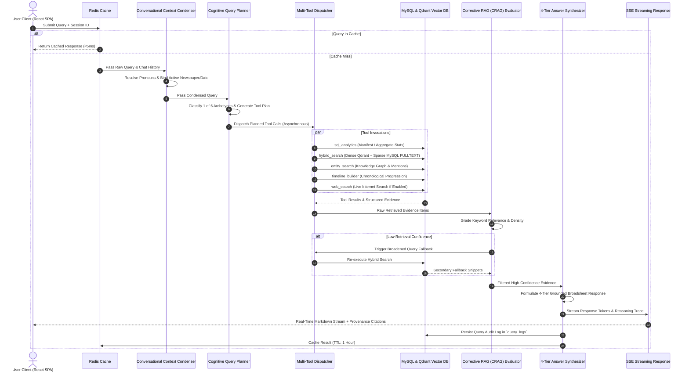

# NewsLens-AI Data Flow & Lifecycle Specifications

This document outlines the complete data flows, state transitions, transformation matrices, and storage interactions across all NewsLens-AI subsystems.

---

## 1. End-to-End Broadsheet PDF Ingestion Flow

```
[ Broadsheet PDF Scan ]
         │
         ▼
┌────────────────────────────────────────────────────────────────────────┐
│ 1. Ingestion Worker Task (Celery + PyMuPDF)                            │
│    • Extract raw digital text blocks, font sizes, and 72 DPI bboxes    │
│    • Rasterize page scans to 300 DPI high-res PNG images               │
│    • Upload page PNGs to MinIO Bucket: `newslens-pages`                │
└──────────────────────────────────┬─────────────────────────────────────┘
                                   │
                                   ▼
┌────────────────────────────────────────────────────────────────────────┐
│ 2. Publication Masthead & Metadata Consensus                           │
│    • Verify newspaper brand against known registry patterns            │
│    • Extract and validate issue publication date (ISO format)          │
│    • Cross-validate over first 3 pages; create MySQL `Issue` record    │
└──────────────────────────────────┬─────────────────────────────────────┘
                                   │
                                   ▼
┌────────────────────────────────────────────────────────────────────────┐
│ 3. Spatial Layout Analysis & Consolidation (Docling + PyMuPDF)         │
│    • Slice page into column lanes, headline bands, and text boxes      │
│    • Pass 0: Drop-cap initial re-attachment & font ligature repair     │
│    • Pass 1: Vertical paragraph stitching within column tracks         │
│    • Pass 2: Horizontal multi-column headline slice merging            │
│    • Pass 3: Statutory ad-envelope boundary wall detection             │
└──────────────────────────────────┬─────────────────────────────────────┘
                                   │
         ┌─────────────────────────┴─────────────────────────┐
         │                                                   │
         ▼                                                   ▼
┌──────────────────────────────────────┐    ┌──────────────────────────────────────┐
│ 4A. Text Assembly & Linearization    │    │ 4B. Visual Asset Harvesting & Triage │
│ • 2D Reading Order Graph (x, y, col) │    │ • Crop photos, logos, charts & tables│
│ • Column de-bundling (Shorts/Briefs) │    │ • Spatial containment article binding│
│ • Kicker extraction & bylines        │    │ • Visual triage (Photo vs Data Chart)│
│ • Cross-page jump-line stitching     │    │ • Dual VLM + Spatial OCR Matrix      │
└──────────────────┬───────────────────┘    └──────────────────┬───────────────────┘
                   │                                           │
                   └─────────────────────┬─────────────────────┘
                                         │
                                         ▼
┌────────────────────────────────────────────────────────────────────────┐
│ 5. Probabilistic 12-Domain Classification & Multi-Topic Tagging        │
│    • Weighted scoring: Headline (3x), Subhead (2x), Body (1x)          │
│    • Domain Context Anchor Dampening for financial/political metaphors │
│    • Secondary Topic Extraction; persist in `Topic` & `ArticleTopic`   │
│    • Insert `Article`, `ArticlePage`, `Photo` in MySQL 8               │
└──────────────────────────────────┬─────────────────────────────────────┘
                                   │
                                   ▼
┌────────────────────────────────────────────────────────────────────────┐
│ 6. Hierarchical Contextual Chunking & Qdrant Dense Indexing            │
│    • Prepend metadata header: [Newspaper|Date|Sec|Headline|Pages]      │
│    • Create dedicated unfragmented visual data chunks for tables       │
│    • Embed via BAAI/bge-m3 (1024-dim); index points into Qdrant        │
└────────────────────────────────────────────────────────────────────────┘
```

---

## 2. Visual Asset Extraction, Scene Analysis & On-Demand Data Flow

```
[ Cropped Image Crop from Broadsheet / On-Demand UI Trigger ]
                │
                ▼
┌────────────────────────────────────────────────────────┐
│ Stage 1: Fast Visual Triage Classification             │
│ • PIL heuristics: dimensions, aspect ratio, variance   │
│ • Lightweight VLM prompt or OCR number density check   │
│   → `table`, `data_chart`, `infographic`, or `photo`   │
└───────────────────────┬────────────────────────────────┘
                        │
         ┌──────────────┴──────────────┐
         │ (Data Bearing)              │ (Editorial Photo)
         ▼                             ▼
┌───────────────────────────────┐ ┌───────────────────────────────┐
│ Stage 2A: Structured VLM      │ │ Stage 2B: Photo Scene         │
│ Extraction (Charts & Tables)  │ │ Intelligence (People/Actions) │
│ • Multimodal GBNF bypass      │ │ • Concise 2-sentence summary  │
│ • Anti-calculation prompt     │ │ • Key visible elements        │
│ • Thinking token recovery     │ │ • Store in `vlm_description`  │
└───────────────┬───────────────┘ └───────────────┬───────────────┘
                │                                 │
   ┌────────────┴────────────┐                    │
   ▼ (Success & Non-Empty)   ▼ (Empty / Timeout)  │
┌────────────────────────┐ ┌────────────────────┐ │
│ Parsed JSON Table      │ │ Spatial OCR Matrix │ │
│ • Markdown table grid  │ │ • Row/Column token │ │
│ • Key metrics & summary│ │   projection       │ │
└───────────┬────────────┘ └─────────┬──────────┘ │
            │                        │            │
            └───────────┬────────────┘            │
                        ▼                         │
┌────────────────────────────────────────────────┐│
│ Stage 3: Numerical Cross-Validation (OCR Match)││
│ • Overlap ratio adjusts confidence score       ││
└───────────────────────┬────────────────────────┘│
                        │                         │
                        └────────────┬────────────┘
                                     ▼
┌────────────────────────────────────────────────────────┐
│ Persistence & Interactive UI Delivery                  │
│ • Store `vlm_description` & `visual_type` in MySQL     │
│ • Index unfragmented Visual DocumentChunk into Qdrant  │
│ • Serve via `GET /api/articles/{id}` and on-demand     │
│   `POST /api/photos/{id}/analyze` to Broadsheet Reader │
└────────────────────────────────────────────────────────┘
```

---

## 3. Conversational Agent Query Lifecycle & LangGraph Execution



---

## 4. Query Archetype Tool Routing Matrix

| Query Archetype | Trigger Conditions & User Intent | Primary Tool | Secondary / Supplementary Tool | Target Output Format |
|---|---|---|---|---|
| **`factual_lookup`** | Specific fact, figure, event, statement, or quote from an article or page. | `hybrid_search` (Dense BGE-M3 + Sparse MySQL RRF) | `entity_search` | Direct verified answer with exact page and article citation. |
| **`quantitative_trend`** | Whole-newspaper summary, section listing, article count, or frequency metrics. | `sql_analytics` (`issue_summary` / `count_articles`) | `hybrid_search` (for sample excerpts) | Structured manifest breakdown by section, page, and category. |
| **`thematic_timeline`** | Chronological progression, evolution, history, or milestone development over time. | `timeline_builder` | `hybrid_search` | Date-ordered milestone trajectory with narrative trajectory canvas links. |
| **`cross_newspaper_comparison`** | Comparative coverage, framing differences, contrasting editorial perspectives, or differential exclusions (*"In X but not in Y"*). | `sql_analytics` (`coverage_difference`) for exclusions; `coverage_analyzer` for multi-broadsheet audits | `hybrid_search` (scoped to target publication and date) | Verified exclusive article manifest with page folios, or side-by-side editorial matrix. |
| **`entity_deep_dive`** | Comprehensive profile of a person, company, agency, or geopolitical entity. | `entity_search` | `timeline_builder` + `hybrid_search` | Entity salience stats, co-occurring entities, and key storylines. |
| **`conversational_meta_query`** | In-context follow-ups, clarifications, or greetings. | Context Condenser / Direct Response | None | Conversational response or clarifying disambiguation modal. |

---

## 5. Corrective RAG (CRAG) & Grounding Lifecycle

```
[ Retrieved Evidence Items from Multi-Tool Execution ]
                          │
                          ▼
┌─────────────────────────────────────────────────────────────┐
│ 1. Evidence Grade & Relevance Scoring                       │
│ • Extract non-stopword query tokens & stem roots            │
│ • Evaluate headline exact match bonus (+0.40)               │
│ • Compute token hit ratio across snippet body               │
│ • Evaluate relational confidence and prominence scores      │
└──────────────────────────────┬──────────────────────────────┘
                               │
            ┌──────────────────┴──────────────────┐
            ▼ (Avg Score >= 0.20)                 ▼ (Avg Score < 0.20)
┌─────────────────────────────────────┐  ┌─────────────────────────────────────┐
│ High-Confidence Evidence State      │  │ Low-Confidence Retrieval Fallback   │
│ • Retain top scored evidence items  │  │ • Trigger fallback hybrid search    │
│ • Pass directly to Synthesizer      │  │ • Re-rank combined evidence pool    │
└──────────────────┬──────────────────┘  └──────────────────┬──────────────────┘
                   │                                        │
                   └───────────────────┬────────────────────┘
                                       │
                                       ▼
┌─────────────────────────────────────────────────────────────┐
│ 2. Empty Evidence Hard-Stop Check                           │
│ • If evidence is empty or only non-matching errors:         │
│   → Short-circuit to strict anti-hallucination message:     │
│     "The archived broadsheets in this database contain      │
│      no verifiable record of [Query]."                      │
│   → DO NOT invent or hallucinate unsupported facts          │
└──────────────────────────────┬──────────────────────────────┘
                               │ (Evidence Present)
                               ▼
┌─────────────────────────────────────────────────────────────┐
│ 3. 4-Tier Grounded Broad-sheet Synthesis                    │
│ • Format Executive Summary                                  │
│ • Compile Bulleted Verified Facts with Inline Citations     │
│ • Extract Broadsheet Perspectives (Front vs Inside Pages)   │
│ • Provide Explore Further Recommended Queries               │
└─────────────────────────────────────────────────────────────┘
```

---

## 6. Storyline Trajectory & Entity Knowledge Graph Construction Flow

```
[ Ingested Articles in MySQL Database ]
                    │
                    ▼
┌────────────────────────────────────────────────────────┐
│ Entity & Relationship Extraction                       │
│ • Extract Named Entities (Person, Org, Location, Event)│
│ • Compute Entity Salience Score (0.0 to 1.0)           │
│ • Populate `entities`, `article_entities` tables       │
└───────────────────┬────────────────────────────────────┘
                    │
         ┌──────────┴──────────┐
         │                     │
         ▼                     ▼
┌──────────────────────┐ ┌──────────────────────────────────────────────┐
│ Entity Co-occurrence │ │ Narrative Trajectory Builder                 │
│ Network Graph        │ │ • Cluster articles by semantic theme & entity │
│ • Compute shared     │ │ • Order chronologically across issue dates   │
│   article co-mentions│ │ • Compute narrative arc & milestone summaries │
│ • Generate Cytoscape │ │ • Cache trajectory graph in Redis (1-hr TTL) │
│   graph JSON payload │ └──────────────────────────────────────────────┘
└──────────────────────┘
```
