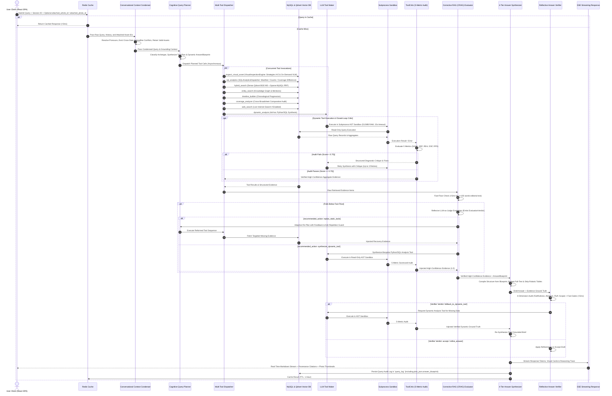

# NewsLens-AI Data Flow & Lifecycle Specifications

This document outlines the complete data flows, state transitions, transformation matrices, and storage interactions across all NewsLens-AI subsystems.

> **Note**: For the comprehensive end-to-end architecture and high-level diagrams, see [**Complete End-to-End Data Flow & System Architecture**](data_flow_architecture.md). For exhaustive step-by-step traces containing exact concrete JSON payloads, SQL queries, table row values, and tool execution examples, refer to [**End-to-End Data Flow & Data Structure Guide**](end_to_end_data_flow_guide.md).

---

## 1. End-to-End Broadsheet PDF Ingestion Flow

```
[ Broadsheet PDF Scan ]
         │
         ▼
┌────────────────────────────────────────────────────────────────────────┐
│ 1. Ingestion Worker Task (Celery + PyMuPDF)                            │
│    • Extract raw digital text blocks, font sizes, and 72 DPI bboxes    │
│    • Rasterize page scans to 300 DPI high-res PNG images               │
│    • Upload page PNGs to MinIO Bucket: `newslens-pages`                │
└──────────────────────────────────┬─────────────────────────────────────┘
                                   │
                                   ▼
┌────────────────────────────────────────────────────────────────────────┐
│ 2. Publication Masthead & Metadata Consensus                           │
│    • Verify newspaper brand against known registry patterns            │
│    • Extract and validate issue publication date (ISO format)          │
│    • Cross-validate over first 3 pages; create MySQL `Issue` record    │
└──────────────────────────────────┬─────────────────────────────────────┘
                                   │
                                   ▼
┌────────────────────────────────────────────────────────────────────────┐
│ 3. Spatial Layout Analysis & Consolidation (Docling + PyMuPDF)         │
│    • Slice page into column lanes, headline bands, and text boxes      │
│    • Pass 0: Drop-cap initial re-attachment & font ligature repair     │
│    • Pass 1: Vertical paragraph stitching within column tracks         │
│    • Pass 2: Horizontal multi-column headline slice merging            │
│    • Pass 3: Statutory ad-envelope boundary wall detection             │
└──────────────────────────────────┬─────────────────────────────────────┘
                                   │
         ┌─────────────────────────┴─────────────────────────┐
         │                                                   │
         ▼                                                   ▼
┌──────────────────────────────────────┐    ┌──────────────────────────────────────┐
│ 4A. Text Assembly & Linearization    │    │ 4B. Visual Asset Harvesting & Triage │
│ • 2D Reading Order Graph (x, y, col) │    │ • Crop photos, logos, charts & tables│
│ • Column de-bundling (Shorts/Briefs) │    │ • Spatial containment article binding│
│ • Kicker extraction & bylines        │    │ • Visual triage (Photo vs Data Chart)│
│ • Cross-page jump-line stitching     │    │ • Dual VLM + Spatial OCR Matrix      │
└──────────────────┬───────────────────┘    └──────────────────┬───────────────────┘
                   │                                           │
                   └─────────────────────┬─────────────────────┘
                                         │
                                         ▼
┌────────────────────────────────────────────────────────────────────────┐
│ 5. Probabilistic 12-Domain Classification & Multi-Topic Tagging        │
│    • Weighted scoring: Headline (3x), Subhead (2x), Body (1x)          │
│    • Domain Context Anchor Dampening for financial/political metaphors │
│    • Secondary Topic Extraction; persist in `Topic` & `ArticleTopic`   │
│    • Insert `Article`, `ArticlePage`, `Photo` in MySQL 8               │
└──────────────────────────────────┬─────────────────────────────────────┘
                                   │
                                   ▼
┌────────────────────────────────────────────────────────────────────────┐
│ 6. Hierarchical Contextual Chunking & Qdrant Dense Indexing            │
│    • Prepend metadata header: [Newspaper|Date|Sec|Headline|Pages]      │
│    • Create dedicated unfragmented visual data chunks for tables       │
│    • Embed via BAAI/bge-m3 (1024-dim); index points into Qdrant        │
└────────────────────────────────────────────────────────────────────────┘
```

---

## 2. Visual Asset Extraction, Scene Analysis & On-Demand Data Flow

```
[ Broadsheet PDF Ingestion Crop ]          [ Broadsheet Reader / Agent Query Trigger ]
                 │                                            │
                 ▼                                            ▼
┌────────────────────────────────────────┐ ┌─────────────────────────────────────────┐
│ Ingestion Fast Triage & Cropping       │ │ Agent `inspect_visual_asset` Invocation │
│ • PIL heuristics: dimensions, aspect   │ │ • Triggered by user query or attached   │
│ • Crop stored in MinIO `bucket_pages`  │ │   `attached_photo_id` / `article_id`    │
│ • Initial fast placeholder / triage    │ │ • Resolves target photo via Strategies  │
│   (`data_chart`, `table`, `photo`)     │ │   Cascade (Strategies A through E)      │
└──────────────────┬─────────────────────┘ └────────────────────┬────────────────────┘
                   │                                            │
                   │                                            ▼
                   │                           ┌─────────────────────────────────────┐
                   │                           │ On-Demand Placeholder Detection     │
                   │                           │ • If `vlm_description` is default   │
                   │                           │   placeholder or requires refresh:  │
                   │                           │   → Stream raw crop from MinIO      │
                   │                           │   → Dispatch to VLM Extractor       │
                   │                           └────────────────┬────────────────────┘
                   │                                            │
                   └─────────────────────┬──────────────────────┘
                                         ▼
┌────────────────────────────────────────────────────────┐
│ Stage 1: Fast Visual Triage Classification             │
│ • PIL heuristics: dimensions, aspect ratio, variance   │
│ • Lightweight VLM prompt or OCR number density check   │
│   → `table`, `data_chart`, `infographic`, or `photo`   │
└───────────────────────┬────────────────────────────────┘
                        │
         ┌──────────────┴──────────────┐
         │ (Data Bearing)              │ (Editorial Photo)
         ▼                             ▼
┌───────────────────────────────┐ ┌───────────────────────────────┐
│ Stage 2A: Structured VLM      │ │ Stage 2B: Photo Scene         │
│ Extraction (Charts & Tables)  │ │ Intelligence (People/Actions) │
│ • Multimodal GBNF bypass      │ │ • Concise 2-sentence summary  │
│ • Anti-calculation prompt     │ │ • Key visible elements        │
│ • Thinking token recovery     │ │ • Store in `vlm_description`  │
└───────────────┬───────────────┘ └───────────────┬───────────────┘
                │                                 │
   ┌────────────┴────────────┐                    │
   ▼ (Success & Non-Empty)   ▼ (Empty / Timeout)  │
┌────────────────────────┐ ┌────────────────────┐ │
│ Parsed JSON Table      │ │ Spatial OCR Matrix │ │
│ • Markdown table grid  │ │ • Row/Column token │ │
│ • Key metrics & summary│ │   projection       │ │
└───────────┬────────────┘ └─────────┬──────────┘ │
            │                        │            │
            └───────────┬────────────┘            │
                        ▼                         │
┌────────────────────────────────────────────────┐│
│ Stage 3: Numerical Cross-Validation (OCR Match)││
│ • Overlap ratio adjusts confidence score       ││
└───────────────────────┬────────────────────────┘│
                        │                         │
                        └────────────┬────────────┘
                                     ▼
┌────────────────────────────────────────────────────────┐
│ Persistence & Interactive UI Delivery                  │
│ • Store `vlm_description` & `visual_type` in MySQL     │
│ • Index unfragmented Visual DocumentChunk into Qdrant  │
│ • Serve via `GET /api/articles/{id}`, on-demand        │
│   `POST /api/photos/{id}/analyze`, and inline visual   │
│   citations `/api/photos/{id}/image` in Agent Assistant│
└────────────────────────────────────────────────────────┘
```

---

## 3. Conversational Agent Query Lifecycle & LangGraph Execution



---

## 4. Query Archetype Tool Routing Matrix

| Query Archetype | Trigger Conditions & User Intent | Primary Tool | Secondary / Supplementary Tool | Target Output Format |
|---|---|---|---|---|
| **`factual_lookup`** | Specific fact, figure, event, statement, or quote from an article, chart, or page. | `hybrid_search` (Dense BGE-M3 + Sparse MySQL RRF) | `inspect_visual_asset` (when chart/table/photo mentioned), `entity_search` | Direct verified answer with exact page and article citation. |
| **`article_catalog`** | Fast manifest listing of articles, front-page leads, or section indices (<200ms). | `sql_analytics` (`issue_summary` / `list_articles` / `count_advertisements`) | None | Tabular manifest by newspaper, date, page, headline, and category. |
| **`quantitative_trend`** | Aggregate metrics, distribution of topics, page counts, or volume analytics. | `sql_analytics` (`aggregate_metrics` / `count_articles` / `get_photo_counts_by_section`); transparent Layer 1 handoff to `dynamic_analysis` | `dynamic_analysis` (Subprocess AST Sandbox) / `hybrid_search` | Statistical summary breakdown with data tables. |
| **`thematic_timeline`** | Chronological progression, evolution, history, or milestone development over time. | `timeline_builder` | `hybrid_search` | Date-ordered milestone trajectory with narrative trajectory canvas links. |
| **`cross_newspaper_comparison`** | Comparative coverage, framing differences, contrasting editorial perspectives, or differential exclusions (*"In X but not in Y"*). | `sql_analytics` (`coverage_difference`) for exclusions; `coverage_analyzer` for multi-broadsheet audits | `hybrid_search` (scoped to target publication and date) | Verified exclusive article manifest with page folios, or side-by-side editorial matrix. |
| **`entity_deep_dive`** | Comprehensive profile of a person, company, agency, or geopolitical entity. | `entity_search` | `timeline_builder` + `hybrid_search` | Entity salience stats, co-occurring entities, and key storylines. |
| **`negative_coverage_audit`** | Audit of topics or events not reported by a specific broadsheet or edition. | `sql_analytics` (`coverage_difference`) | `hybrid_search` (anti-hallucination verification) | Explicit verification of absence or unmentioned topics across editions. |

---

## 5. Corrective RAG (CRAG) & Reflexive Grounding Lifecycle

```
[ Retrieved Evidence Items from Multi-Tool Execution ]
                          │
                          ▼
┌─────────────────────────────────────────────────────────────┐
│ 1. Fast-Floor Evaluation Check (<5ms)                       │
│ • Check: Evidence >= 1 high-confidence broadsheet hit AND   │
│   clean body text >= 100 words                              │
└──────────────────────────────┬──────────────────────────────┘
                               │
            ┌──────────────────┴──────────────────┐
            ▼ (Passes Fast Floor)                 ▼ (Below Fast Floor)
┌─────────────────────────────────────┐ ┌─────────────────────────────────────┐
│ High-Confidence Immediate Pass      │ │ Reflexive LLM-as-Judge Evaluation   │
│ • Skip LLM evaluation latency       │ │ • Prompt evaluator with evidence    │
│ • is_sufficient = True, score = 1.0 │ │ • Emit typed EvaluationVerdict      │
└──────────────────┬──────────────────┘ └──────────────────┬──────────────────┘
                   │                                       │
                   │           ┌───────────────────────────┴───────────────────────────┐
                   │           ▼ (replan_static_tools)                                 ▼ (synthesize_dynamic_tool)
                   │  ┌─────────────────────────────────┐                     ┌─────────────────────────────────┐
                   │  │ Closed-Loop Adaptive Re-Plan    │                     │ Dynamic ToolMaker Recovery      │
                   │  │ • replan_with_feedback_async    │                     │ • Generate bespoke Python/SQL   │
                   │  │ • Widen dates / expand top_k    │                     │ • ToolCritic 5-dimension audit  │
                   │  │ • Anti-repetition guard         │                     │ • AST Subprocess Sandbox        │
                   │  └────────────────┬────────────────┘                     └────────────────┬────────────────┘
                   │                   │                                                       │
                   └───────────────────┼───────────────────────────────────────────────────────┘
                                       ▼
┌─────────────────────────────────────────────────────────────┐
│ 2. Empty Evidence Hard-Stop Check                           │
│ • If evidence is empty or only non-matching errors:         │
│   → Short-circuit to strict anti-hallucination notice:      │
│     "The archived broadsheets in this database contain      │
│      no verifiable record of [Query]."                      │
│   → DO NOT invent or hallucinate unsupported facts          │
└──────────────────────────────┬──────────────────────────────┘
                               │ (Evidence Present)
                               ▼
┌─────────────────────────────────────────────────────────────┐
│ 3. Blueprint-Driven Grounded Broadsheet Synthesis           │
│ • Compile prompt structure dynamically from AnswerBlueprint │
│ • Preserve full parent text (up to 7,500 chars) for single  │
│   article questions, filtering visual annotation noise      │
│ • Strip mechanical robotic catalog tables from summaries    │
│ • Enforce strict broadsheet citation format:                │
│   [{Newspaper}, {YYYY-MM-DD}, Page {N}, "{Headline}"]       │
│ • Enforce Quantitative Metric Absence Hard-Stop             │
└──────────────────────────────┬──────────────────────────────┘
                               │
                               ▼
┌─────────────────────────────────────────────────────────────┐
│ 4. Reflective Answer Verification (answer_verifier.py)      │
│ • Fast Gates (<5ms): scope check, date alignment, absence   │
│ • Reflexive LLM Audit: 4-dimension groundedness & fluff cut │
│ • If evidence gap diagnosed: emit fallback_to_dynamic_tool  │
│   → Loops back to execute_dynamic_code (1-cycle ceiling)    │
│ • Verified brief passed to SSE streaming engine             │
└─────────────────────────────────────────────────────────────┘
```

---

## 6. Storyline Trajectory & Entity Knowledge Graph Construction Flow

```
[ Ingested Articles in MySQL Database ]
                    │
                    ▼
┌────────────────────────────────────────────────────────┐
│ Entity & Relationship Extraction                       │
│ • Extract Named Entities (Person, Org, Location, Event)│
│ • Compute Entity Salience Score (0.0 to 1.0)           │
│ • Populate `entities`, `article_entities` tables       │
└───────────────────┬────────────────────────────────────┘
                    │
         ┌──────────┴──────────┐
         │                     │
         ▼                     ▼
┌──────────────────────┐ ┌──────────────────────────────────────────────┐
│ Entity Co-occurrence │ │ Narrative Trajectory Builder                 │
│ Network Graph        │ │ • Cluster articles by semantic theme & entity │
│ • Compute shared     │ │ • Order chronologically across issue dates   │
│   article co-mentions│ │ • Compute narrative arc & milestone summaries │
│ • Generate Cytoscape │ │ • Cache trajectory graph in Redis (1-hr TTL) │
│   graph JSON payload │ └──────────────────────────────────────────────┘
└──────────────────────┘
```

---

## 7. Broadsheet Reader to Agent Visual Attachment Data Flow

When a user reads an archived newspaper in the interactive **Broadsheet Reader** and encounters a complex visual graphic, chart, or photo, they can route that specific asset directly into the **Agent Assistant** for deep multimodal inquiry.

```mermaid
sequenceDiagram
    autonumber
    actor Reader as User / Broadsheet Reader (React)
    participant State as Global Reader State
    participant Assistant as Agent Assistant Component
    participant API as FastAPI Backend (/api/agent/query)
    participant Condenser as Conversational Condenser
    participant Executor as Concurrent Tool Executor
    participant VLM as VLM Visual Data Extractor (MinIO)
    participant DB as MySQL Database

    Reader->>State: User clicks "Ask Agent About This Infographic / Photo"
    State->>Assistant: Open Assistant Panel with attachedAsset payload
    Note over Assistant: Renders attached asset banner<br/>with thumbnail, headline & date
    Reader->>Assistant: Submits query (e.g. "Explain the GDP projections in this chart")
    Assistant->>API: POST /api/agent/query<br/>{query, attached_article_id, attached_photo_id}
    API->>Condenser: Pass query, chat history, and attached IDs
    Condenser->>Condenser: Bind attached IDs to active turn;<br/>Purge on subsequent unrelated turns
    Condenser->>Executor: Plan tool execution with Strategy A/C (photo_id/article_id)
    Executor->>DB: Query Photo record by photo_id or article_id
    alt vlm_description is Placeholder
        Executor->>VLM: Stream raw image crop from MinIO bucket_pages
        VLM->>VLM: Run Multimodal VLM OCR & tabular synthesis
        VLM->>DB: Persist synthesized vlm_description to article_photos
    end
    DB-->>Executor: Complete visual description, caption, and metadata
    Executor-->>API: Synthesize evidence including visual asset
    API-->>Assistant: Stream response with is_visual_asset citation & /api/photos/{id}/image
    Assistant-->>Reader: Render rich response with interactive visual card thumbnail
```

### 7.1 Lifecycle & Anti-Leakage Guardrails
1. **Interactive Attachment Banner**:
   - `AgentAssistant.jsx` displays an active blue attachment chip above the chat input: `Attached: [Infographic/Photo] Headline (Date, Page X)` with a dismiss `×` button.
2. **First-Turn Binding**:
   - When the user submits their query, `attached_article_id` and `attached_photo_id` are included in the `QueryRequest` body.
   - `extract_active_issue_from_history()` and `condenser.py` bind these IDs directly to tool arguments (`photo_id`, `article_id`).
3. **Cross-Turn Parameter Purge**:
   - On the next turn, if the user asks an unrelated question or references a different date/newspaper, Guardrails 1, 2, and 3 immediately purge `photo_id`, `article_id`, `headline`, and `page_number`, preventing visual context leakage across independent questions.
4. **Cross-Date Asset Conflict Eviction**:
   - In `query.py` and `graph.py`, if the user explicitly specifies a publication date (e.g. `1/8/2026`) that conflicts with the attached asset's date (e.g. `2026-08-05`), the attached asset is immediately evicted.
   - In `executor.py`, an immutable invariant dictates: `effective_date = explicit_query_date or asset_date or default_date`, ensuring attached asset dates can never overwrite explicit user query dates.

---

## 8. Dynamic Tool Synthesis, Closed-Loop ToolCritic & Subprocess AST Sandbox Flow

When broadsheet analytical queries require bespoke aggregations, variances, or relational calculations that do not exist in predefined static tools, NewsLens-AI dynamically synthesizes, audits, and executes custom Python functions within a secure, sandboxed subprocess with automated self-refinement.

```
┌────────────────────────────────────────────────────────────────────────┐
│ 1. Trigger Event                                                       │
│    • Direct Agent Plan: Archetype planner schedules `dynamic_analysis` │
│    • Layer 1 Fallback: Unsupported parameter in `sql_analytics`        │
│    • Layer 2 Fallback: CRAG evaluator encounters 0-evidence on an      │
│      analytical/computational query                                    │
└──────────────────────────────────┬─────────────────────────────────────┘
                                   │
                                   ▼
┌────────────────────────────────────────────────────────────────────────┐
│ 2. LLM Tool Maker Synthesis (`tool_maker.py`)                         │
│    • Loads comprehensive broadsheet MySQL schema prompt                │
│    • Formulates prompt with user question & analytical goal            │
│    • Auto-Import Pre-Injection: Detects unimported `re`, `math`,       │
│      `statistics`, `pd`, `np`, `text` calls and injects headers        │
│    • Generates Python script: `async def analyze(db, query, context)`  │
└──────────────────────────────────┬─────────────────────────────────────┘
                                   │
                                   ▼
┌────────────────────────────────────────────────────────────────────────┐
│ 3. AST Pre-Execution Safety Inspection (`sandbox.py: ASTSafetyScanner`)│
│    • Static inspection of Python Abstract Syntax Tree (ast.parse)      │
│    • Checks Whitelist: `math`, `datetime`, `re`, `json`, `collections`,│
│      `itertools`, `typing`, `sqlalchemy`, `decimal`                    │
│    • Rejects Blacklisted Modules: `os`, `sys`, `subprocess`, `socket`, │
│      `shutil`, `urllib`, `requests`, `pathlib`, `ctypes`, etc.         │
│    • Rejects Blacklisted Builtins: `open`, `eval`, `exec`, `compile`,  │
│      `__import__`, `globals`, `locals`, `getattr`, `setattr`           │
│    • Verifies absence of dunder attribute escape patterns              │
└──────────────────────────────────┬─────────────────────────────────────┘
                                   │
                                   ▼
┌────────────────────────────────────────────────────────────────────────┐
│ 4. Subprocess Sandbox Execution (`sandbox_runner.py`)                  │
│    • Spawns isolated worker via `subprocess.Popen([sys.executable])`   │
│    • Pre-populated `exec_globals` (re, math, statistics, pd, np, text) │
│    • Passes code, arguments, and credentials via JSON stdin            │
│    • Enforces 15-second timeout and 512MB RAM resource limit           │
│    • Establishes read-only DB connection with autocommit disabled      │
│    • Executes `analyze(db, query, context)` inside try/finally         │
│    • Unconditional `connection.rollback()` guarantees zero mutations   │
│    • Returns structured JSON payload to stdout                         │
└──────────────────────────────────┬─────────────────────────────────────┘
                                   │
                                   ▼
┌────────────────────────────────────────────────────────────────────────┐
│ 5. Diagnostic ToolCritic Audit (`tool_critic.py`)                      │
│    • Executes 5-Metric Scorecard:                                      │
│      1. SASC: Syntactic & AST Security Compliance (1.0 or 0.0)         │
│      2. SRF:  SQL Schema Fidelity (remaps hallucinated columns,        │
│               requires DISTINCT on multi-table joins, allows aliases)  │
│      3. REH:  Runtime Subprocess Health (0 exit code, no exceptions)   │
│      4. DSF:  Data-to-Summary Faithfulness (legitimate absence vs      │
│               narrative hallucination, accepts aggregate tables)       │
│      5. RPS:  Intent Alignment & Filter Plausibility (ISO date norm)   │
│    • If Audit Fails (Score < 0.70):                                    │
│      Re-prompts ToolMaker with structured diagnostic critique over     │
│      token-budgeted 4-message trace (Up to 3 attempts)                 │
└──────────────────────────────────┬─────────────────────────────────────┘
                                   │
                                   ▼
┌────────────────────────────────────────────────────────────────────────┐
│ 6. Evidence Injection & Agent Reasoning Continuation                   │
│    • Encapsulates verified result into `ToolExecutionRecord`           │
│    • Injects high-confidence evidence ($1.0$) into `AgentState`        │
│    • Emits SSE stage `generating_analysis_tool`                        │
│    • Hands over to Synthesizer for 4-tier journalistic brief           │
└────────────────────────────────────────────────────────────────────────┘
```


