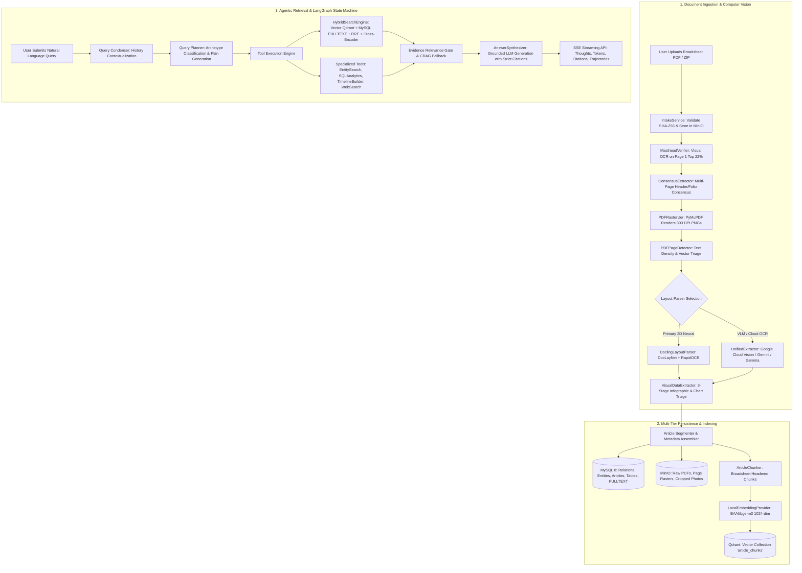
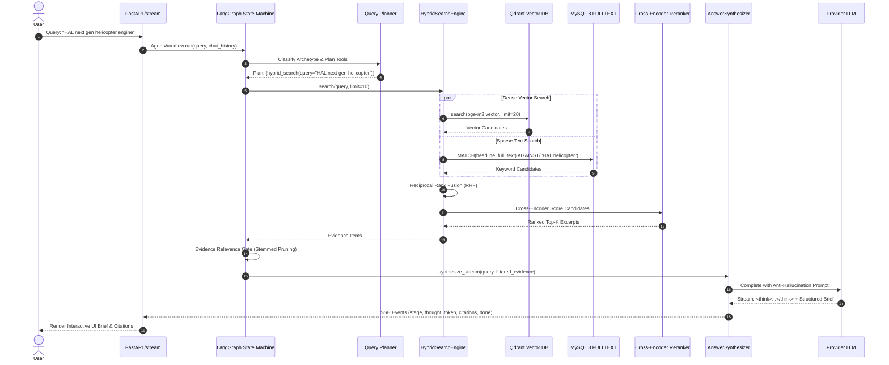
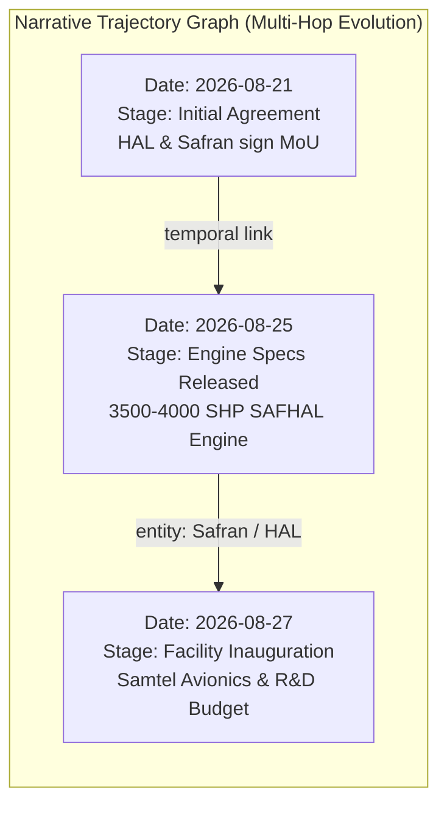

# NewsLens-AI: Complete End-to-End Data Flow & System Architecture

This document provides a comprehensive technical breakdown of the entire **NewsLens-AI** data pipeline, tracking the transformation of a raw newspaper PDF from initial upload, through computer vision and layout extraction, into multi-tier storage, and finally through the LangGraph agentic RAG retrieval and synthesis state machine.

---

## 1. High-Level Pipeline Flowchart



---

## 2. Stage-by-Stage Detailed Breakdown

### Stage 1: Document Intake & Archive Ingestion
1. **Entrypoint**: `POST /api/ingest/upload` (Handled by [`backend/app/api/routers/ingest.py`](file:///Users/piyushgoel/Downloads/Projects/NewsLens-AI/backend/app/api/routers/ingest.py) and [`backend/app/ingestion/intake.py`](file:///Users/piyushgoel/Downloads/Projects/NewsLens-AI/backend/app/ingestion/intake.py)).
2. **Idempotency & Checksumming**:
   - Calculates the **SHA-256** hash of the incoming binary stream.
   - Checks if an `IngestionJob` or `Issue` with this hash already exists (unless `force=True` is provided).
3. **Archive Storage**:
   - Streams the unmodified source PDF to MinIO bucket `newslens-originals` under `originals/{job_id}/{filename}`.
4. **Database Registration**:
   - Creates an `IngestionJob` row (tracking `total_files`, `processed_files`, `status='running'`).
   - Creates an `Issue` record in MySQL with `ingestion_status='pending'`.

---

### Stage 2: Masthead Verification & Publication Consensus
*Broadsheet newspapers often have complex scanned headers, non-standard unicode dates, or irregular fonts.*

1. **Visual Masthead Verifier** ([`backend/app/ingestion/masthead_verifier.py`](file:///Users/piyushgoel/Downloads/Projects/NewsLens-AI/backend/app/ingestion/masthead_verifier.py)):
   - PyMuPDF crops the **top 22% of Page 1** (the masthead banner).
   - Runs high-speed local OCR using `RapidOCR` (ONNX Runtime with PP-OCRv6 models, `<0.6s`).
   - Normalizes Unicode superscripts (e.g., `²⁷⁰⁸²⁰²⁶` $\to$ `27082026`).
   - Matches brand rules (e.g., `The Economic Times`, `Mint`, `The Hindu`, `Business Standard`, `The Indian Express`, `The Times of India`).
   - Parses diverse broadsheet date formats (e.g., `Thursday, 27 August 2026`, `Aug 27, 2026`, `27-08-2026`).
2. **Multi-Page Consensus Extractor** ([`backend/app/ingestion/consensus_extractor.py`](file:///Users/piyushgoel/Downloads/Projects/NewsLens-AI/backend/app/ingestion/consensus_extractor.py)):
   - Inspects headers/running folios across pages 1 to 15.
   - Applies a **5x weighting** to header-zone dates over body-text dates.
   - Updates the MySQL `Issue` row with verified `newspaper_id`, publication `issue_date`, and `edition`.

---

### Stage 3: Page Rasterization & PyMuPDF Digital Triage
1. **PyMuPDF Rendering** ([`backend/app/ingestion/rasterizer.py`](file:///Users/piyushgoel/Downloads/Projects/NewsLens-AI/backend/app/ingestion/rasterizer.py)):
   - Iterates through all PDF pages.
   - Renders each page to a **300 DPI high-resolution PNG image** using `PyMuPDF` (`fitz.Matrix(300/72, 300/72)`).
   - Uploads rasterized page PNGs to MinIO bucket `newslens-pages` at `pages/{newspaper_id}/{issue_date}/{edition}/page_{num}.png`.
   - Inserts or updates `Page` rows in MySQL (`width_px`, `height_px`, `raster_object_key`, `ingestion_status='rasterized'`).
2. **PDF Page Detector** ([`backend/app/ingestion/detector.py`](file:///Users/piyushgoel/Downloads/Projects/NewsLens-AI/backend/app/ingestion/detector.py)):
   - Extracts native digital character blocks, bounding boxes, and font properties.
   - Classifies each page as **native digital** (rich text layer) or **scanned print** (sparse/empty text requiring full OCR).

---

### Stage 4: Layout Parsing & 2D Article Segmentation

NewsLens-AI supports multiple configurable layout engines selected via `parser_engine`:

```
┌─────────────────────────────────────────────────────────────────────────────┐
│                          PARSER ENGINE SELECTION                            │
├──────────────────────┬──────────────────────────────────────────────────────┤
│ Engine Option        │ Underlying Technology & Purpose                      │
├──────────────────────┼──────────────────────────────────────────────────────┤
│ "docling" (Default)  │ DocLayNet 2D neural layout + RapidOCR                │
│ "gemini" / "gemma"   │ VLM-based visual polygon extraction & crop OCR       │
│ "google_vision"      │ Google Cloud Vision Document Text API                │
│ "mineru"             │ Magic-PDF / MinerU broadsheet pipeline               │
│ "auto"               │ Docling 2D Neural with automatic fallback            │
└──────────────────────┴──────────────────────────────────────────────────────┘
```

#### The Docling 2D Neural Layout Parser (`DoclingLayoutParser`):
* **Neural Object Detection**: Docling's vision backbone identifies 2D document elements:
  * `title`: Article headlines and major banners.
  * `section_header`: Editorial category markers (`MARKETS`, `NATIONAL`, `OPINION`).
  * `paragraph`: Columnar body text blocks.
  * `table`: Tabular grids and financial reports.
  * `picture`: Editorial photographs, charts, and infographics.
* **Elimination of Cross-Column Bleeding**: Unlike naive 1D reading order heuristics (which read across column gutters), Docling tracks vertical column geometries, ensuring stories in parallel columns never mix.
* **Byline & Dateline Isolation**:
  * Matches author names (`Manu Pubby`, `Krishna Kumar`, `Dipanjan Roy Chaudhury`) and agency slugs (`PTI`, `Reuters`, `Our Bureau`).
  * Extracts dateline markers (`New Delhi:`, `Mumbai:`, `Bengaluru:`).
* **Subhead Coalescence**: Coalesces internal all-caps section dividers (e.g. `### STRONG FOUNDATION`) into the active article body rather than creating false orphan articles.

---

### Stage 5: Multimodal Infographics, Charts & Tables
Handled by [`backend/app/ingestion/visual_extractor.py`](file:///Users/piyushgoel/Downloads/Projects/NewsLens-AI/backend/app/ingestion/visual_extractor.py):

1. **Stage 1 — Fast Visual Triage**:
   - Aspect ratio and area heuristics filter out decorative dividing lines and small icons.
   - Classifies visual assets into `data_chart`, `table`, `infographic`, or `photo`.
2. **Stage 2 — Structured VLM Extraction**:
   - Data charts and tabular graphics are sent to a Vision-Language Model (Qwen-VL or Gemini Vision).
   - Generates clean GitHub-flavored markdown tables, an executive summary, and bulleted trend conclusions.
3. **Stage 3 — Numerical Cross-Validation**:
   - Cross-checks numbers in the VLM-generated markdown against local OCR tokens in the same bounding box to prevent numeric hallucination.
4. **Visual Chunk Creation**:
   - Stores the structured markdown in a dedicated `ArticleChunk` with `chunk_type="visual"` and `has_visual_data=True`.

---

### Stage 6: Chunking, Dense Vector Embedding & Multi-Tier Storage

1. **Broadsheet Contextual Chunker** ([`backend/app/ingestion/chunker.py`](file:///Users/piyushgoel/Downloads/Projects/NewsLens-AI/backend/app/ingestion/chunker.py)):
   - Chunks text articles into 400–500 token segments with 50-token sliding overlap.
   - Injects a **Context Header** at the top of every chunk:
     ```
     [Newspaper: {Name} | Date: {YYYY-MM-DD} | Section: {Section} | Headline: {Headline} | Page: {P}]
     ```
2. **Dense Vector Embeddings** ([`backend/app/ingestion/embedder.py`](file:///Users/piyushgoel/Downloads/Projects/NewsLens-AI/backend/app/providers/local_embedding_provider.py)):
   - Embeds each chunk into a **1024-dimensional dense vector** using `BAAI/bge-m3` via `sentence-transformers` (or `nomic-embed-text` / `text-embedding-3-large`).
3. **Qdrant Vector Store** ([`backend/app/storage/qdrant_store.py`](file:///Users/piyushgoel/Downloads/Projects/NewsLens-AI/backend/app/storage/qdrant_store.py)):
   - Upserts points into collection `article_chunks` with metadata payloads:
     - `article_id`, `issue_id`, `newspaper_name`, `issue_date`, `page_number`, `headline`, `section`, `has_visual_data`, `bboxes`.
4. **MySQL 8 Relational Database** ([`backend/app/models/`](file:///Users/piyushgoel/Downloads/Projects/NewsLens-AI/backend/app/models/)):
   - Stores `articles` with `FULLTEXT(headline, full_text)`.
   - Stores `article_pages` with bounding boxes.
   - Extracts and links named entities (`entities`, `article_entities`) and topics (`topics`, `article_topics`).

---

### Stage 7: Query Pipeline & Hybrid Retrieval Toolbelt

When a user asks a question in the UI:



#### Detailed Retrieval Steps:
1. **Query Condensation** ([`backend/app/agent/query_condenser.py`](file:///Users/piyushgoel/Downloads/Projects/NewsLens-AI/backend/app/agent/query_condenser.py)):
   - Contextualizes conversational follow-ups (e.g. *"What about its French partner?"* $\to$ *"Safran partnership with HAL for helicopter engine"*).
2. **Query Planner** ([`backend/app/agent/planner.py`](file:///Users/piyushgoel/Downloads/Projects/NewsLens-AI/backend/app/agent/planner.py)):
   - Classifies query into archetypes:
     - `factual_lookup`: Specific event or metric.
     - `comparative_perspective`: Differing coverage across newspapers.
     - `temporal_evolution`: Evolution over dates.
     - `quantitative_trend`: Charts, stocks, macro indicators.
3. **Hybrid Search Engine** ([`backend/app/retrieval/hybrid_search.py`](file:///Users/piyushgoel/Downloads/Projects/NewsLens-AI/backend/app/retrieval/hybrid_search.py)):
   - **Vector Search**: Qdrant cosine similarity over 1024-dim dense space.
   - **Keyword Search**: MySQL `MATCH ... AGAINST` in natural language mode with query expansion.
   - **Reciprocal Rank Fusion (RRF)**: Merges ranks using $RRF = \sum \frac{1}{60 + \text{rank}_i}$.
   - **Cross-Encoder Reranker**: Deep token-level relevance scoring using `ms-marco-MiniLM-L-6-v2`.
4. **Specialized Tools**:
   - `EntityFilter`: N-hop entity exploration (`search_by_entity`).
   - `SQLAnalytics`: Aggregate SQL metrics (article counts, section distribution).
   - `TimelineBuilder`: Chronological narrative trajectories.
   - `WebSearchEngine`: Live web verification (DuckDuckGo / Tavily / Serper).

---

### Stage 8: Corrective RAG & Answer Synthesis

1. **Evidence Relevance Gate (CRAG)** ([`backend/app/agent/graph.py`](file:///Users/piyushgoel/Downloads/Projects/NewsLens-AI/backend/app/agent/graph.py)):
   - Evaluates retrieved evidence items against query token stems.
   - Automatically prunes completely unrelated chunks (relevance score = 0) so they cannot pollute LLM context.
   - If zero grounded evidence is found, triggers fallback entity search or web search.
2. **Answer Synthesizer** ([`backend/app/agent/synthesizer.py`](file:///Users/piyushgoel/Downloads/Projects/NewsLens-AI/backend/app/agent/synthesizer.py)):
   - Enforces strict anti-hallucination negative constraints:
     - Zero fabrication of dates or publisher names.
     - Zero ungrounded external entities.
     - Mandates structured broadsheet format:
       - `### ⚡ Executive Summary`
       - `### 📌 Key Verified Facts & Highlights` (with inline citations `[Newspaper, YYYY-MM-DD, Page P, "Headline"]`)
       - `### 📰 Broadsheet Perspectives & Focus Areas`
       - `### 🔍 Explore Further`
3. **Server-Sent Events (SSE) Streaming** ([`backend/app/api/routers/query.py`](file:///Users/piyushgoel/Downloads/Projects/NewsLens-AI/backend/app/api/routers/query.py)):
   - Streams live thought tokens (`event: thought`), markdown tokens (`event: token`), resolved citations (`event: citations`), and final metadata (`event: done`).

---

### Stage 9: Narrative Trajectories & Storyline Graphs

Handled by [`backend/app/agent/timeline_builder.py`](file:///Users/piyushgoel/Downloads/Projects/NewsLens-AI/backend/app/agent/timeline_builder.py):



* **Chronological Clustering**: Groups articles discussing the same overarching event across multiple publication dates.
* **Sentiment & Focus Trajectory**: Tracks how media framing changes over time (e.g. initial announcement $\to$ financial debate $\to$ regulatory approval).
* **Multi-Hop Graph Tracing**: Connects entities across disparate news reports (e.g., Company $A \to$ Joint Venture $B \to$ Government Contract $C$).

---

## 3. Storage Layer Architecture Summary

| Store | Technology | What is Stored | Access Pattern |
|---|---|---|---|
| **Relational DB** | **MySQL 8** (`aiomysql`) | `newspapers`, `issues`, `pages`, `articles`, `article_pages`, `photos`, `tables`, `entities`, `topics`, `events`, `query_log` | High-throughput relational joins, foreign keys, FULLTEXT keyword search |
| **Vector DB** | **Qdrant** (`qdrant-client`) | 1024-dim dense embeddings of text chunks and visual infographic tables | Dense cosine similarity vector search with JSON payload filters |
| **Object Store** | **MinIO / S3** (`minio`) | Raw original PDFs (`newslens-originals`), 300 DPI page rasters (`newslens-pages`), cropped photo PNGs | High-performance binary asset streaming |
| **In-Memory Cache** | **Redis 7** (`redis-py`) | Query result cache, condensed query keys, timeline caches, SSE pub/sub | Sub-millisecond deterministic caching |
