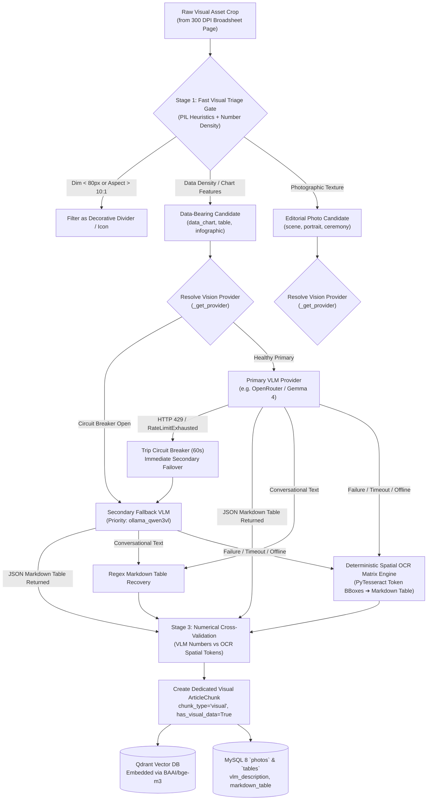
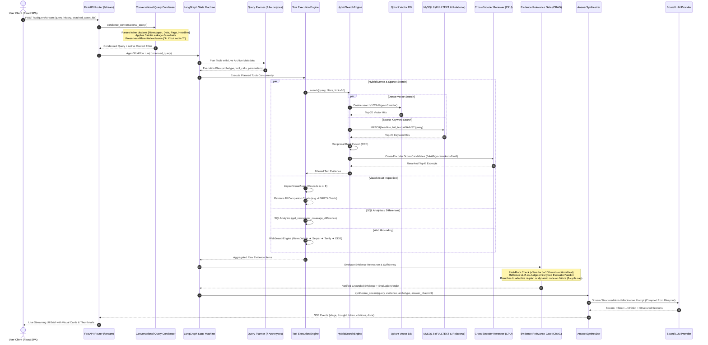

# NewsLens-AI: Complete End-to-End Data Flow & System Architecture

This document provides a comprehensive, rigorous technical breakdown of the entire **NewsLens-AI** data pipeline, tracking the transformation of raw broadsheet newspaper PDFs from intake, computer vision, and spatial layout extraction, through multi-tier persistence, into hybrid vector/relational search, and finally through the LangGraph agentic RAG retrieval and synthesis state machine.

---

## 1. High-Level System Architecture & Global Topology

```mermaid
flowchart TD
    subgraph CLIENT ["1. Presentation Layer (React 18 + Vite SPA)"]
        UI_Reader["Broadsheet Reader<br/>(300 DPI Canvas + Overlay BBoxes)"]
        UI_Visual["Visual Asset Inspector<br/>(Charts, Photos, Tables)"]
        UI_Agent["Agentic Assistant<br/>(SSE Streaming Reasoning & Citations)"]
        UI_Studio["Model Settings Studio<br/>(Auto-Save, Hot-Swapping, Health Pings)"]
        UI_Graph["Entity Knowledge Graph<br/>(Multi-Hop Relational Network)"]
    end

    subgraph INTAKE ["2. Document Intake & Computer Vision Pipeline"]
        PDF["Broadsheet PDF / ZIP Archive"] --> Compressor["Pre-Ingestion Compressor<br/>(fitz.deflate / Ghostscript)"]
        Compressor --> SHA["SHA-256 Idempotency Check"]
        SHA --> MinIO_Orig[("MinIO: newslens-originals")]
        SHA --> Masthead["Visual Masthead Verifier<br/>(Top 22% Page 1 RapidOCR)"]
        Masthead --> Consensus["Multi-Page Folio Consensus<br/>(5x Header-Weighted Voting)"]
        Consensus --> Rasterizer["PyMuPDF Rasterizer<br/>(300 DPI High-Res Rendering)"]
        Rasterizer --> MinIO_Pages[("MinIO: newslens-pages")]
        Rasterizer --> LayoutParser{"Layout Parser Engine<br/>(Registry Resolved)"}
        LayoutParser -->|Primary Local| Docling["Docling 2D Neural Parser<br/>(DocLayNet + RapidOCR)"]
        LayoutParser -->|Cloud VLM / Direct| CloudLayout["Google Cloud Vision / Gemini / Gemma"]
        Docling & CloudLayout --> LayoutEngine["5-Pass Spatial Layout Engine<br/>(Column De-bundling & Jump Stitching)"]
        LayoutEngine --> VisualExtractor["3-Stage Visual Extractor<br/>(Triage + VLM + Spatial OCR Matrix)"]
    end

    subgraph STORAGE ["3. Multi-Tier Persistence & Knowledge Layer"]
        LayoutEngine --> MySQL[("MySQL 8 (System of Record)<br/>Articles, FULLTEXT, Entities, Photos")]
        VisualExtractor --> MySQL
        LayoutEngine --> Chunker["Contextual Broadsheet Chunker<br/>(400-500 Tok + Context Headers)"]
        VisualExtractor --> Chunker
        Chunker --> Embedder["Embedding Provider<br/>(BAAI/bge-m3 1024-dim Dense)"]
        Embedder --> Qdrant[("Qdrant Vector DB<br/>article_chunks Collection")]
        MySQL -.-> Redis[("Redis 7 Cache<br/>Query Results, Celery Broker")]
    end

    subgraph AGENTIC ["4. Agentic RAG & LangGraph State Machine"]
        UserQuery["User Query + Attached Assets"] --> Condenser["Conversational Query Condenser<br/>(Inline Citations & 3 Guardrails)"]
        Condenser --> Planner["Dynamic Query Planner<br/>(7 Archetypes & Live Archive Metadata)"]
        Planner --> Dispatcher["Concurrent Tool Execution Engine"]
        
        Dispatcher --> Tool_Hybrid["HybridSearchEngine<br/>(Dense Qdrant + MySQL FULLTEXT)"]
        Dispatcher --> Tool_Visual["InspectVisualAsset<br/>(Multi-Chart Cascade A-E)"]
        Dispatcher --> Tool_SQL["SQLAnalytics<br/>(Coverage Differences & Manifests)"]
        Dispatcher --> Tool_Entity["EntityFilter<br/>(N-Hop Relational Search)"]
        Dispatcher --> Tool_Timeline["TimelineBuilder<br/>(Narrative Trajectories)"]
        Dispatcher --> Tool_Web["WebSearchEngine (4-Tier Grounding)<br/>NewsData.io ➔ Serper ➔ Tavily ➔ DDG"]
        Dispatcher --> Tool_Dynamic["DynamicAnalysis<br/>(Subprocess AST Sandbox)"]

        Tool_Hybrid --> RRF["Reciprocal Rank Fusion (RRF)<br/>+ Cross-Encoder Reranker (CPU)"]
        RRF & Tool_Visual & Tool_SQL & Tool_Entity & Tool_Timeline & Tool_Web & Tool_Dynamic --> CRAG{"Evidence Relevance Gate (CRAG)<br/>(Stemmed Query Pruning)"}
        
        CRAG -->|Sufficient Grounding| Synthesizer["AnswerSynthesizer<br/>(4-Tier Grounded Brief)"]
        CRAG -->|Zero Evidence / Analytical Query| ToolMaker["LLM Tool Maker<br/>(Ad-Hoc Tool Synthesis)"]
        ToolMaker --> Tool_Dynamic
        Tool_Dynamic --> ToolCritic["ToolCritic (5-Metric Audit)<br/>(SASC, SRF, REH, DSF, RPS)"]
        ToolCritic -->|Pass (>= 0.70)| CRAG
        ToolCritic -->|Defect Detected| ToolMaker
        CRAG -->|Zero Evidence / Ambiguous| FallbackRouter["Fallback Web/Entity Search<br/>or Anti-Hallucination Notice"]
        FallbackRouter --> Synthesizer

        Synthesizer --> SSE["FastAPI SSE Streaming Router<br/>(Stages, Thoughts, Tokens, Visual Cards)"]
    end

    CLIENT <-->|HTTP REST & SSE Events| AGENTIC
```

---

## 2. Dynamic Model Provider Registry & Sovereign / Cloud Architecture

NewsLens-AI decouples application pipelines from hardcoded AI vendors using a **Hot-Swappable Provider Registry Architecture** ([`backend/app/providers/registry.py`](file:///Users/piyushgoel/Downloads/Projects/NewsLens-AI/backend/app/providers/registry.py)) managed by [`model_config.yaml`](file:///Users/piyushgoel/Downloads/Projects/NewsLens-AI/model_config.yaml) and the frontend **Model Settings Studio** ([`frontend/src/components/ModelSettingsStudio.jsx`](file:///Users/piyushgoel/Downloads/Projects/NewsLens-AI/frontend/src/components/ModelSettingsStudio.jsx)).

```
┌─────────────────────────────────────────────────────────────────────────────────────────────────┐
│                                 DYNAMIC MODEL PROVIDER REGISTRY                                 │
├──────────────────────────────┬───────────────────────────────┬──────────────────────────────────┤
│ Tier 1: Local Sovereign      │ Tier 2: Cloud Dual-Key        │ Tier 3: Direct Cloud Enterprise  │
│ (100% On-Premise / Offline)  │ (OpenRouter Rotated Pool)     │ (Commercial Enterprise APIs)     │
├──────────────────────────────┼───────────────────────────────┼──────────────────────────────────┤
│ • Ollama Llama 3.1 8B        │ • OpenRouter Gemma 4 26B      │ • Google Gemini 3.7 Flash & Pro  │
│ • Ollama DeepSeek R1 14B     │ • OpenRouter Nemotron 3.5     │ • OpenAI GPT-4o & GPT-4o-mini    │
│ • Ollama Qwen 3 VL / 2.5 VL  │ • Cooldown Circuit Breaker    │ • NVIDIA NIM Catalog             │
│ • Docling Layout + RapidOCR  │ • Dual-Key 429 Failover       │ • Google Cloud Vision OCR        │
│ • BAAI/bge-m3 (1024d Dense)  │ • HTTP 429 Cooldown Timer     │ • Text-Embedding-3-Large         │
└──────────────────────────────┴───────────────────────────────┴──────────────────────────────────┘
```

### Granular Pipeline Task Bindings

The platform binds individual tasks across 3 operational stages:
1. **Stage 1 — Agentic Reasoning & Synthesis**:
   - `query_planner`: Autonomous tool sequence planner & sub-query generator (`ollama_llama3`).
   - `answerer`: Multi-newspaper factual synthesizer & citation linker (`ollama_llama3`).
2. **Stage 2 — Vision & Broadsheet Ingestion**:
   - `visual_extraction`: Multimodal chart, table, and scene extractor (`ollama_qwen3vl`).
   - `layout_analysis`: 2D spatial layout and column parsing (`docling_parser`).
   - `document_parser`: Broadsheet hierarchy structure extractor (`docling_parser`).
   - `ocr`: Character transcription engine (`docling_parser`).
3. **Stage 3 — Classification & Indexing**:
   - `embedding`: 1024-dimensional dense vector generator (`local_embed_bge`).
   - `article_segmentation`: Complex multi-column jump-line stitcher (`ollama_deepseek`).
   - `classification`: 12-domain probabilistic categorization (`ollama_llama3`).
   - `metadata_extraction`: Publication, edition, and date extractor (`ollama_llama3`).

### Auto-Persistence & Runtime Swapping
- Modifying bindings in the UI sends a `PUT /api/settings/model-bindings` request.
- The backend writes changes directly to `model_config.yaml` on disk and invokes `registry.invalidate_all()`.
- Active ingestion jobs, query planners, and synthesizers immediately instantiate the newly bound models without application downtime.

---

## 3. Stage-by-Stage Document Ingestion Data Flow

```
[ Broadsheet PDF / ZIP Archive ]
               │
               ▼
┌────────────────────────────────────────────────────────────────────────┐
│ Stage 1: Document Intake, Compression & Checksumming                   │
│ • Validate PDF header and magic bytes                                  │
│ • Pre-ingestion compression (fitz.deflate / Ghostscript)               │
│ • Calculate SHA-256 content checksum                                   │
│ • Stream original PDF to MinIO: `newslens-originals`                   │
│ • Register `IngestionJob` and `Issue` (status='pending') in MySQL 8    │
└──────────────────────────────────┬─────────────────────────────────────┘
                                   │
                                   ▼
┌────────────────────────────────────────────────────────────────────────┐
│ Stage 2: Masthead Verification & Publication Consensus                │
│ • Crop Page 1 top 22% masthead zone via PyMuPDF                        │
│ • RapidOCR (ONNX Runtime, <0.6s) with superscript normalization        │
│ • Multi-page header/running-folio voting (Pages 1–15, 5x header weight)│
│ • Resolve canonical newspaper_id, issue_date (ISO), edition            │
└──────────────────────────────────┬─────────────────────────────────────┘
                                   │
                                   ▼
┌────────────────────────────────────────────────────────────────────────┐
│ Stage 3: Page Rasterization & Digital Triage                           │
│ • PyMuPDF renders 300 DPI high-resolution PNGs (Matrix 300/72)         │
│ • Upload page rasters to MinIO: `newslens-pages`                       │
│ • Classify pages: Native Digital (rich text) vs Scanned Print (OCR req)│
└──────────────────────────────────┬─────────────────────────────────────┘
                                   │
                                   ▼
┌────────────────────────────────────────────────────────────────────────┐
│ Stage 4: 5-Pass Spatial Layout Analysis & 2D Article Segmentation      │
│ • Pass 0: Drop-cap initial re-attachment & font ligature repair        │
│ • Pass 1: Vertical paragraph stitching within column tracks            │
│ • Pass 2: Horizontal multi-column headline slice merging               │
│ • Pass 3: Statutory ad-envelope boundary wall detection                │
│ • Pass 4: Cross-page jump-line stitching (linking continued stories)   │
└──────────────────────────────────┬─────────────────────────────────────┘
                                   │
         ┌─────────────────────────┴─────────────────────────┐
         │                                                   │
         ▼                                                   ▼
┌──────────────────────────────────────┐    ┌──────────────────────────────────────┐
│ Stage 5A: Text Linearization & Tag   │    │ Stage 5B: 3-Stage Visual Extractor   │
│ • 2D Reading Order Graph             │    │ • Fast Visual Triage Gate            │
│ • 12-Domain Probabilistic Classifier │    │ • Structured VLM or Photo Scene      │
│ • Secondary Topic Extraction         │    │ • Local Secondary VLM Failover       │
│ • Insert Article, ArticlePage in DB  │    │ • Deterministic Spatial OCR Matrix   │
└──────────────────┬───────────────────┘    └──────────────────┬───────────────────┘
                   │                                           │
                   └─────────────────────┬─────────────────────┘
                                         │
                                         ▼
┌────────────────────────────────────────────────────────────────────────┐
│ Stage 6: Contextual Chunking, Dense Embedding & Indexing               │
│ • Inject broadsheet context header: [Newspaper | Date | Sec | Page]    │
│ • Dedicated unfragmented visual data chunks (`chunk_type="visual"`)    │
│ • Generate 1024-dim dense vectors using BAAI/bge-m3                    │
│ • Upsert vector points to Qdrant collection: `article_chunks`          │
│ • Populate MySQL FULLTEXT(headline, full_text) & entity relationships │
└────────────────────────────────────────────────────────────────────────┘
```

### Stage 1: Document Intake & Pre-Ingestion Compression
1. **Entrypoints**: `POST /api/ingest/upload` and `POST /api/ingest/upload-archive` (handles single PDFs, multi-PDF batches, and `.zip` archives).
2. **Pre-Ingestion Compression**:
   - Executes stream compression via `fitz.deflate` or Ghostscript downsampling high-resolution photographic embeds from print production size ($\sim 50\text{MB}$) down to analytical archival size ($\sim 12\text{MB}$) with zero loss of textual or tabular clarity.
3. **Idempotency & Checksumming**:
   - Calculates **SHA-256** hash of the compressed binary stream.
   - Rejects or bypasses redundant processing unless `force=true`.
4. **Archive Storage**:
   - Streams raw binary to MinIO bucket `newslens-originals` under `originals/{job_id}/{filename}`.
   - Inserts `IngestionJob` row in MySQL (`status='running'`) and dispatches async Celery worker task (`ingest_pdf_task`).

### Stage 2: Masthead Verification & Consensus Metadata Extraction
1. **Visual Masthead Verifier** ([`backend/app/ingestion/metadata.py`](file:///Users/piyushgoel/Downloads/Projects/NewsLens-AI/backend/app/ingestion/metadata.py)):
   - PyMuPDF crops the **top 22% of Page 1**.
   - Runs `RapidOCR` (ONNX Runtime, `<0.6s`).
   - Normalizes Unicode superscripts (e.g. `²⁷⁰⁸²⁰²⁶` $\to$ `27082026`).
   - Evaluates broadsheet brand patterns (e.g. *The Economic Times*, *Mint*, *The Hindu*, *Business Standard*, *The Indian Express*, *The Times of India*).
2. **Multi-Page Consensus Extractor**:
   - Inspects running headers/folios across Pages 1–15.
   - Applies a **5x weighting** to header-zone dates over body-text dates.
   - Aggregates voting distribution and updates `Issue` record (`newspaper_id`, `issue_date`, `edition`).

### Stage 3: Page Rasterization & PyMuPDF Digital Triage
1. **High-Resolution Rasterization** ([`backend/app/ingestion/rasterizer.py`](file:///Users/piyushgoel/Downloads/Projects/NewsLens-AI/backend/app/ingestion/rasterizer.py)):
   - Renders every page to **300 DPI high-resolution PNG** via `PyMuPDF` (`fitz.Matrix(300/72, 300/72)`).
   - Uploads to MinIO bucket `newslens-pages` at `pages/{newspaper_id}/{issue_date}/{edition}/page_{num}.png`.
   - Inserts/updates `Page` rows in MySQL (`width_px`, `height_px`, `raster_object_key`, `status='rasterized'`).
2. **PDF Page Detector** ([`backend/app/ingestion/detector.py`](file:///Users/piyushgoel/Downloads/Projects/NewsLens-AI/backend/app/ingestion/detector.py)):
   - Measures text density, vector lines, and digital character layers.
   - Flags pages as native digital (rich text) or scanned print (requiring full OCR).

### Stage 4: 5-Pass Spatial Layout Analysis & 2D Article Segmentation
Handled by `backend/app/ingestion/layout/` and `backend/app/ingestion/parsers/`:
- **Pass 0: Drop-Cap & Ligature Repair**: Detects oversized first letters, reattaching them to subsequent lead words; repairs ligatures (`fi`, `fl`, `ff`).
- **Pass 1: Vertical Paragraph Stitching**: Slices columns into distinct geometric vertical tracks, eliminating cross-column reading bleed.
- **Pass 2: Multi-Column Headline Slice Merging**: Merges headline spans stretching across 2 to 6 columns, binding child text blocks under their parent headline.
- **Pass 3: Boundary Wall Detection**: Identifies statutory advertisement frames, divider lines, and standalone boxes, isolating editorial news from commercial copy.
- **Pass 4: Cross-Page Jump Stitching**: Analyzes continuation markers (*"Continued on Page 4"*, *"from Page 1"*), stitching fragmented articles into unified canonical stories.

---

## 4. Visual Asset Intelligence, VLM Extraction & Failover Data Flow



### 3-Stage Visual Pipeline Architecture
1. **Stage 1: Fast Visual Triage Gate**:
   - Filters tiny icons, logos, and divider borders via aspect ratio and pixel variance.
   - Classifies image as `data_chart`, `table`, `infographic`, or `photo`.
2. **Stage 2: Structured VLM Extraction & Scene Intelligence**:
   - **Data Visuals**: Extracts structured markdown table, executive summary, and bulleted trend indicators.
   - **Editorial Photos**: Analyzes photograph to generate a concise, factual 2-sentence scene description identifying visible key subjects and actions.
3. **Stage 3: Numerical Cross-Validation**:
   - Extracts numeric tokens from the VLM-generated Markdown table and cross-references them with raw OCR tokens extracted from the exact same bounding box region.
   - Bumps confidence score based on intersection ratio, preventing numerical hallucinations in financial and macro charts.

### Circuit Breaker & Resilient Failover Cascade
- If OpenRouter or cloud vision providers exhaust keys and return HTTP 429:
  1. `trip_circuit_breaker(60.0, reason)` trips the circuit breaker for 60 seconds.
  2. The system immediately attempts failover to Tier 1 secondary VLM: **`ollama_qwen3vl`** (local hardware-accelerated model running with zero external network dependency).
  3. If both cloud and local VLMs are unavailable, the **Deterministic 2D Spatial OCR Matrix Reconstruction Engine** projects OCR token bounding box coordinates into tabular rows and columns, guaranteeing zero ingestion failure.

---

## 5. 4-Tier Journalistic Web Search Grounding Data Flow

To provide high-fidelity external grounding and live temporal verification without polluting responses with unaccredited blogs or scraper spam, NewsLens-AI integrates a **4-Tier Web Search Cascade** ([`backend/app/retrieval/web_search.py`](file:///Users/piyushgoel/Downloads/Projects/NewsLens-AI/backend/app/retrieval/web_search.py)):

```
┌────────────────────────────────────────────────────────────────────────┐
│                  USER QUERY REQUIRING LIVE WEB GROUNDING               │
└──────────────────────────────────┬─────────────────────────────────────┘
                                   │
                                   ▼
┌────────────────────────────────────────────────────────────────────────┐
│ Tier 1: NewsData.io Accredited News API (Primary Journalistic Engine)  │
│ • Queries accredited global and national press agencies                │
│ • Parameters: `q={query}`, `country=in`, `language=en`, `category`     │
│ • Delivers structured publisher `source_name`, `pubDate`, and deep url │
│ • Validates response; handles rate limits & API key exhaustion         │
└──────────────────────────────────┬─────────────────────────────────────┘
                                   │
                     ┌─────────────┴─────────────┐
                     │ (Success: >= 1 Article)   │ (Empty / Rate Limited / Error)
                     ▼                           ▼
       ┌───────────────────────────┐ ┌───────────────────────────────────┐
       │ Structured News Evidence  │ │ Tier 2: Serper API (Google Search)│
       └───────────────────────────┘ └─────────────────┬─────────────────┘
                                                       │
                                         ┌─────────────┴─────────────┐
                                         │ (Success)                 │ (Empty / Error)
                                         ▼                           ▼
                           ┌───────────────────────────┐ ┌───────────────────────┐
                           │ Google SERP Snippets      │ │ Tier 3: Tavily API    │
                           └───────────────────────────┘ └───────────┬───────────┘
                                                                     │
                                                       ┌─────────────┴───────────┐
                                                       │ (Success)               │ (Empty / Error)
                                                       ▼                         ▼
                                         ┌─────────────────────────┐ ┌───────────────────┐
                                         │ Tavily Research Context │ │ Tier 4: DuckDuckGo│
                                         └─────────────────────────┘ └───────────────────┘
```

| Search Tier | Provider | Primary Strength | Metadata Extracted |
|---|---|---|---|
| **Tier 1 (Primary)** | **NewsData.io** (`newsdataapi`) | Accredited broadsheets & news agencies (Reuters, Mint, The Hindu, PTI) | `title`, `source_name`, `pubDate`, `link`, `description`, `category` |
| **Tier 2 (Fallback)** | **Serper API** | High-index Google Web Search results | `title`, `snippet`, `link`, `date` |
| **Tier 3 (Fallback)** | **Tavily Search** | AI agent research engine optimized for RAG synthesis | `title`, `content`, `url`, `score` |
| **Tier 4 (Offline)** | **DuckDuckGo** | Zero-credential, zero-cost fallback HTML scraper | `title`, `snippet`, `link` |

---

## 6. Agentic Retrieval & LangGraph Execution Sequence



### Retrieval & Synthesis Step Details

1. **Conversational Query Condensation** ([`backend/app/agent/condenser.py`](file:///Users/piyushgoel/Downloads/Projects/NewsLens-AI/backend/app/agent/condenser.py)):
   - **Inline Citation Extraction**: Parses complex broadsheet citations such as `[4] Hindustan Times, 2026-08-03, Page 4, Headline: "The growing bipolarity in the world..."`.
   - **Attached Asset Propagation & Date Isolation**: Carries forward `attached_article_id` or `attached_photo_id` selected in the broadsheet viewer, but strictly evicts attached assets if their publication date or headline conflicts with explicit query intention.
   - **Headline Conflict Invalidation**: Automatically clears stale article IDs when the user transitions to a different article headline or topic.
   - **Differential Exclusion Retention**: Preserves comparative context (*"list all those 11 articles"* $\to$ *"list all articles in The Goan but not in The Morning Standard on 2026-08-01"*).
2. **Cognitive Query Planner & Dynamic Answer Blueprint** ([`backend/app/agent/planner.py`](file:///Users/piyushgoel/Downloads/Projects/NewsLens-AI/backend/app/agent/planner.py), [`backend/app/agent/models.py`](file:///Users/piyushgoel/Downloads/Projects/NewsLens-AI/backend/app/agent/models.py)):
   - Grounded with live archive metadata (`get_archive_metadata()`), preventing the model from inventing dates or newspapers.
   - Formulates both tool invocations and an **`AnswerBlueprint`** with ordered `SectionSpec` directives (narrative, bullet lists, metric cards, markdown tables, timelines), target word counts, and prohibited elements.
   - Classifies query into 1 of 7 Archetypes:
     - `factual_lookup`: Specific figures, quotes, events, or companion charts.
     - `article_catalog`: Front-page lead manifests and section listings.
     - `cross_newspaper_comparison`: Differing coverage, multi-broadsheet audits, and differential exclusions (*"In X but not in Y"*).
     - `thematic_timeline`: Evolution of storylines across time.
     - `quantitative_trend`: Macro indicators, financial distributions, and volume metrics.
     - `entity_deep_dive`: Multi-hop entity exploration and salience profiling.
     - `negative_coverage_audit`: Rigorous proof of unreported topics across publications.
3. **Specialized Tool Execution** ([`backend/app/agent/executor.py`](file:///Users/piyushgoel/Downloads/Projects/NewsLens-AI/backend/app/agent/executor.py)):
   - `InspectVisualAsset`: Executes 5-Tier Strategy Cascade (A: photo_id; B: headline; C: article_id; D: multi-criteria DB; E: scoped caption/VLM).
     - Enforces query-date priority invariant (`effective_date = explicit_query_date or asset_date`).
     - Streams on-demand raw crop bytes from MinIO for lazy VLM table transcription.
   - `DynamicAnalysis`, `ToolMaker` & `ToolCritic` ([`backend/app/agent/tool_maker.py`](file:///Users/piyushgoel/Downloads/Projects/NewsLens-AI/backend/app/agent/tool_maker.py), [`backend/app/agent/tool_critic.py`](file:///Users/piyushgoel/Downloads/Projects/NewsLens-AI/backend/app/agent/tool_critic.py), [`backend/app/agent/sandbox.py`](file:///Users/piyushgoel/Downloads/Projects/NewsLens-AI/backend/app/agent/sandbox.py)):
     - Synthesizes bespoke Python/SQL functions for novel analytical queries.
     - **Auto-Import Pre-Injection**: Injects missing standard imports (`re`, `math`, `statistics`, `json`, `pd`, `np`, `text`).
     - Runs in an isolated subprocess with strict AST safety scanning, 15s timeout, 512MB RAM cap, and read-only DB transactions with pre-imported `exec_globals`.
     - **5-Metric Closed-Loop Self-Refinement**: Audited by `ToolCritic` across SASC, SRF, REH, DSF, and RPS. Re-prompts LLM with structured diagnostic critique over token-budgeted history (up to 3 retries).
     - **Layer 1 Fallback**: Intercepts unsupported parameters in `sql_analytics` and hands off to `dynamic_analysis`.
   - `SQLAnalytics`: Whole-issue catalogs, native photo count analytics by section (`get_photo_counts_by_section`), advertisement counts, date range filtering (`date_from`/`date_to`), and deterministic coverage differences (`get_newspaper_coverage_difference`).
   - `CoverageAnalyzer`: Multi-newspaper 3-tier negative coverage matrix audits.
   - `EntityFilter`: Relational entity lookups and co-occurrence graphs.
   - `TimelineBuilder`: Narrative trajectories and chronological storyline graphs.
   - `WebSearchEngine`: NewsData.io accredited news grounding.
4. **Reflexive CRAG Evaluator & Closed-Loop Re-Planning** ([`backend/app/agent/graph.py`](file:///Users/piyushgoel/Downloads/Projects/NewsLens-AI/backend/app/agent/graph.py), [`backend/app/agent/evaluator.py`](file:///Users/piyushgoel/Downloads/Projects/NewsLens-AI/backend/app/agent/evaluator.py)):
   - **Fast-Floor Bypass (<5ms)**: Immediate approval if evidence has $\ge 1$ high-confidence broadsheet hit and $\ge 100$ words of clean editorial body text.
   - **Reflexive LLM-as-Judge**: Emits structured `EvaluationVerdict` (`quality_score`, `gap_diagnosis`, `recommended_action`, `corrective_hints`).
   - **Closed-Loop Adaptive Re-Planning (`replan_with_feedback_async`)**: Re-plans targeted tools, relaxes date bounds, expands `top_k`, and enforces an anti-repetition guard preventing duplicate tool calls.
   - **Dynamic Recovery Nodes**: Routes to `execute_adaptive_replan` or `execute_dynamic_code` with a strict 1-cycle ceiling (`recovery_attempts < 1`).
5. **Blueprint-Driven Answer Synthesizer & Visual Citation Cards** ([`backend/app/agent/synthesizer.py`](file:///Users/piyushgoel/Downloads/Projects/NewsLens-AI/backend/app/agent/synthesizer.py)):
   - **Dynamic Prompt Compilation**: Translates `AnswerBlueprint` into structured prompt sections via `compile_structure_from_blueprint()`, honoring user formatting constraints (word counts, bullet points, table exclusions).
   - **Full-Text Single-Article Budgeting**: Allocates up to 7,500 characters of `parent_article_text` for focused inquiries, eliminating snippet truncation.
   - **Robotic Catalog Table Elimination**: Deterministically strips mechanical tables (`| # | Headline | Section | Page | Words |`) from single-article narrative answers.
   - **Photo Annotation Noise Reduction**: Suppresses bulky visual bounding box dumps during purely textual and editorial queries.
   - **Quantitative Metric Absence Hard-Stop**: Truthfully reports absence when numerical metrics cannot be computed, preventing mathematical hallucinations.
   - **Strict Citations**: Guarantees broadsheet citations `[Newspaper, YYYY-MM-DD, Page N, "Headline"]` and emits visual citation metadata with thumbnail endpoints (`/api/photos/{id}/image`).
6. **Server-Sent Events (SSE) Protocol** ([`backend/app/api/routers/query.py`](file:///Users/piyushgoel/Downloads/Projects/NewsLens-AI/backend/app/api/routers/query.py)):
   - `event: stage`: Live progress notifications (`condensing_query`, `planning_tools`, `executing_tools`, `evaluating_evidence`, `re_planning`, `synthesizing_answer`).
   - `event: thought`: Model internal chain-of-thought tokens.
   - `event: token`: Streaming answer tokens.
   - `event: citations`: Fully resolved textual and visual citation cards.
   - `event: done`: Execution timing, token counts, and completion status.

---

## 7. Entity Knowledge Graph & Relational Intelligence

NewsLens-AI extracts, resolves, and indexes named entities across every ingested article to power relational exploration and multi-hop narrative tracking:

```mermaid
graph LR
    subgraph ENTITY_GRAPH ["Entity Co-Occurrence Knowledge Graph"]
        E1(("Entity: HAL<br/>(Organization)"))
        E2(("Entity: Safran<br/>(Organization)"))
        E3(("Entity: SAFHAL Helicopter Engine<br/>(Product / Defense)"))
        E4(("Entity: Ministry of Defence<br/>(Government)"))
        
        E1 ---|co-occurs (weight: 12)| E2
        E2 ---|developed_product| E3
        E1 ---|manufactures| E3
        E1 ---|procurement_contract| E4
    end

    subgraph ARTICLE_NODES ["Article Evidence References"]
        A1["Article #42101<br/>'HAL, Safran ink engine pact'<br/>Mint (Page 1)"]
        A2["Article #42188<br/>'Defence procurement cleared'<br/>The Hindu (Page 5)"]
    end

    E1 -.->|mentioned in| A1
    E2 -.->|mentioned in| A1
    E3 -.->|subject of| A1
    E4 -.->|mentioned in| A2
```

### Relational Schema & Storage
- `entities`: Canonical entity registry (`id`, `name`, `entity_type`, `canonical_name`, `salience_score`, `frequency`).
  - Entity types: `PERSON`, `ORGANIZATION`, `LOCATION`, `PRODUCT`, `EVENT`, `CONCEPT`.
- `article_entities`: Join table linking articles to entities (`article_id`, `entity_id`, `mention_count`, `salience`, `sentiment`).
- `entity_relations`: Graph edges capturing co-occurrence strength and contextual relationships across articles.

---

## 8. Storage Layer Architecture & Data Lifecycle Matrix

| Layer | Component | Engine / Driver | Stored Data & Schema | Access Patterns & Indexing |
|---|---|---|---|---|
| **System of Record** | Relational Database | **MySQL 8** (`aiomysql` / SQLAlchemy 2) | • `newspapers`, `issues`, `pages`<br/>• `articles`, `article_pages`<br/>• `photos`, `tables`<br/>• `entities`, `article_entities`<br/>• `topics`, `article_topics`<br/>• `query_log`, `ingestion_jobs` | • Foreign keys & relational joins<br/>• `FULLTEXT(headline, full_text)`<br/>• B-tree indexes on `(newspaper_id, issue_date)`<br/>• Sub-5ms metadata queries |
| **Vector Store** | Dense Vector DB | **Qdrant** (`qdrant-client`) | • Collection: `article_chunks`<br/>• 1024-dim dense vectors (`BAAI/bge-m3`)<br/>• Payload: `article_id`, `issue_id`, `newspaper_name`, `issue_date`, `page_number`, `headline`, `section`, `has_visual_data`, `bboxes` | • Cosine similarity search (HNSW index)<br/>• Payload pre-filtering on `newspaper_name`, `issue_date`, `section`<br/>• Sub-15ms vector retrieval |
| **Object Store** | S3-Compatible Blob Store | **MinIO** (`minio-py`) | • Bucket `newslens-originals`: Raw source PDFs<br/>• Bucket `newslens-pages`: 300 DPI high-res page rasters<br/>• Cropped visual assets & chart PNGs | • High-throughput binary streaming<br/>• Public thumbnail HTTP endpoints (`/api/photos/{id}/image`)<br/>• Immutable asset storage |
| **In-Memory Cache** | Key-Value & Queue | **Redis 7** (`redis-py`) | • Celery background worker task queue<br/>• Query response cache<br/>• Condensed query hash cache<br/>• Timeline trajectory cache<br/>• SSE Pub/Sub channels | • In-memory sub-millisecond lookups<br/>• Distributed task locks (`redis-lock`)<br/>• Automatic TTL expiration (1h to 24h) |

---

## 9. Failure Modes, Circuit Breakers & Resilience Matrix

| Failure Scenario | Trigger Detection | Immediate Mitigation | Ultimate Safety Net |
|---|---|---|---|
| **Cloud VLM Rate Limit** | OpenRouter returns HTTP 429 (`RateLimitExhaustedError`) | `trip_circuit_breaker(60.0)` activates; subsequent requests bypass failing provider; immediate failover to **`ollama_qwen3vl`** | **Deterministic Spatial OCR Matrix Engine** reconstructs tabular data from token coordinates; zero ingestion abort |
| **Malformed VLM Output** | VLM returns conversational text instead of structured JSON | Regex extraction of Markdown table blocks (`extract_markdown_table_from_raw_text`) | Deterministic OCR text density fallback |
| **Low-Confidence OCR** | Poor print quality, bleed-through, or broken text on old broadsheets | Consensus multi-page folio voting across Pages 1–15; RapidOCR ONNX with Unicode superscript normalization | Minimum confidence threshold filter; human verification flag in DB |
| **Zero Retrieval Hits** | Query mentions unindexed historical date or outside broadsheet scope | Evidence Relevance Gate detects 0 grounded chunks; triggers fallback web search via NewsData.io | Enforces strict Anti-Hallucination notice; explicitly states zero archival evidence found |
| **Unforeseen Analytics / Unsupported Parameters** | Query asks for custom metrics (page counts, size distribution) exceeding static tools | Layer 1 intercepts unsupported parameter and hands off to `dynamic_analysis`; Layer 2 CRAG invokes `ToolMaker` | Synthesizes ad-hoc tool; executes safely in subprocess AST Sandbox with 15s timeout, 512MB RAM cap, and read-only rollback |
| **Hallucinated Columns / Cartesian Joins in Dynamic Tools** | Generated tool queries non-existent columns (`published_at`) or joins without `DISTINCT` | `ToolCritic` SRF metric detects schema violations; re-prompts LLM with structured diagnostic critique | Bounded 3-retry loop with token-budgeted trace; enforces relational schema fidelity before evidence injection |
| **Statistical Metric Absence / Failed Analytics** | Query asks for variance, std dev, or complex ratios but tool fails or returns empty | Synthesizer detects absence of computed numbers in verified tool evidence | `QUANTITATIVE & STATISTICAL METRIC ABSENCE HARD-STOP` strictly forbids hallucinating numbers, truthfully reporting computation unavailability |
| **Cross-Date Asset / Stale Context Leakage** | User switches dates across multi-turn session with active attached asset | Query condenser and graph routers detect date conflict and prune attached asset | Executor strictly enforces `effective_date = explicit_query_date`, preventing queries against mismatched issues |
| **Network Outage / Cloud Down** | All external APIs (OpenRouter, Gemini, OpenAI) unreachable | Model Settings Studio switches to **Local Sovereign Preset** | 100% offline air-gapped execution via Ollama (Llama 3.1, DeepSeek R1, Qwen 3 VL), Docling, and local BGE-M3 |
