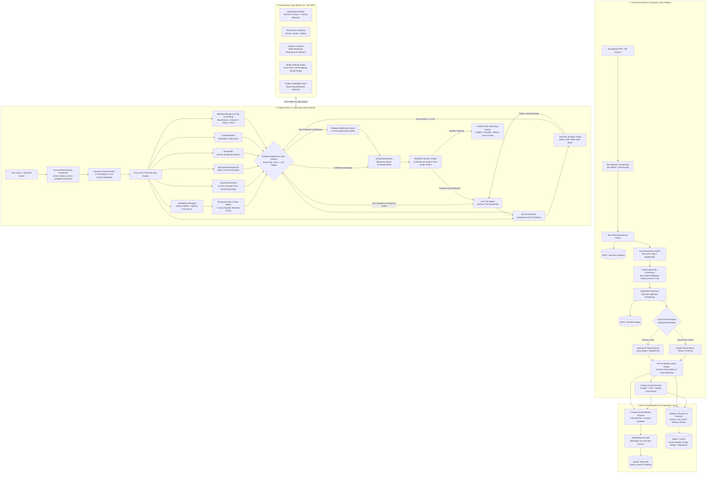
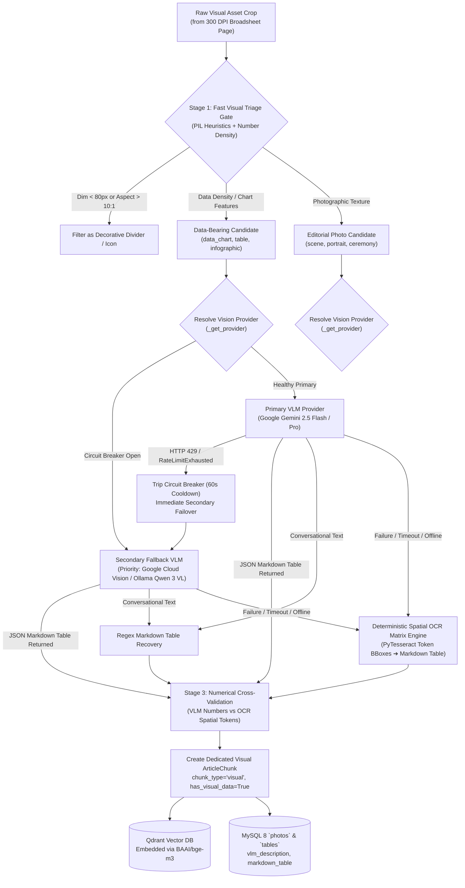
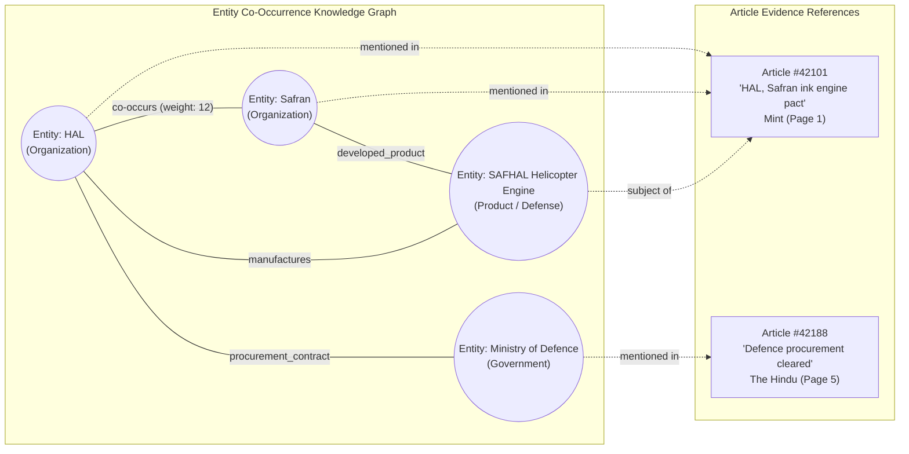
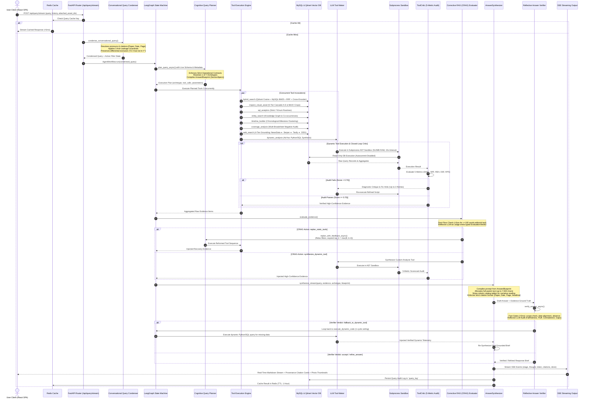
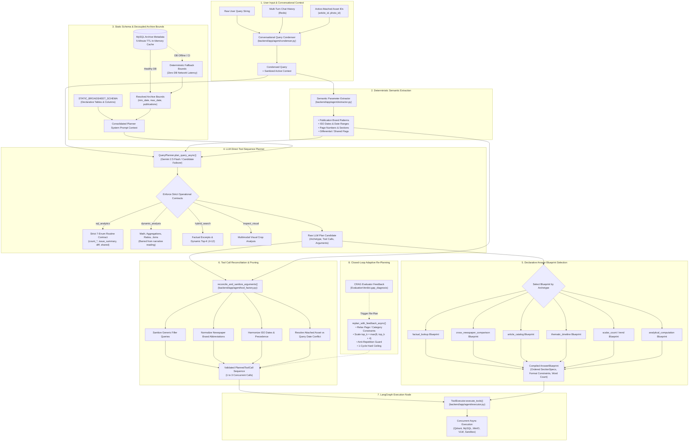
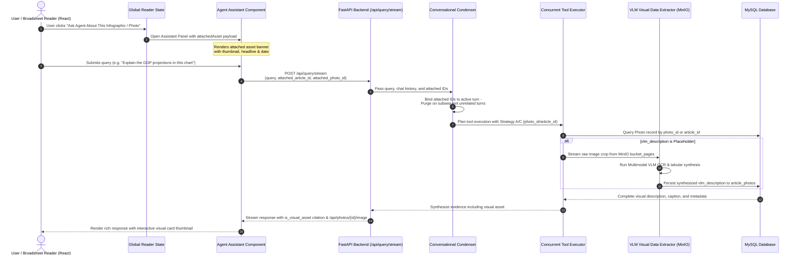
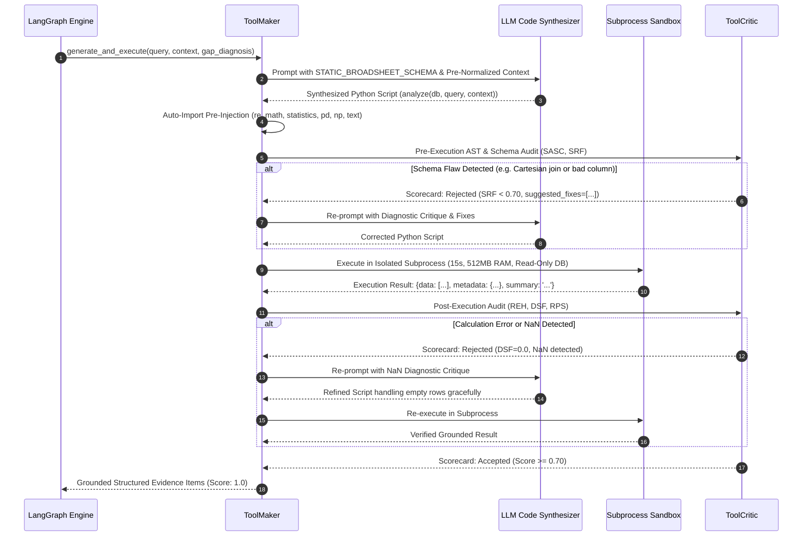
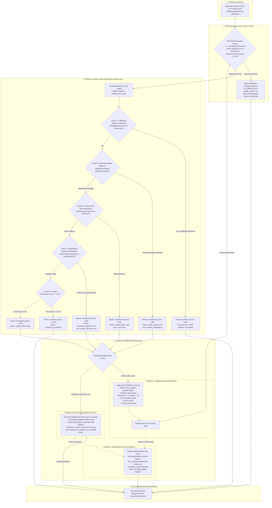
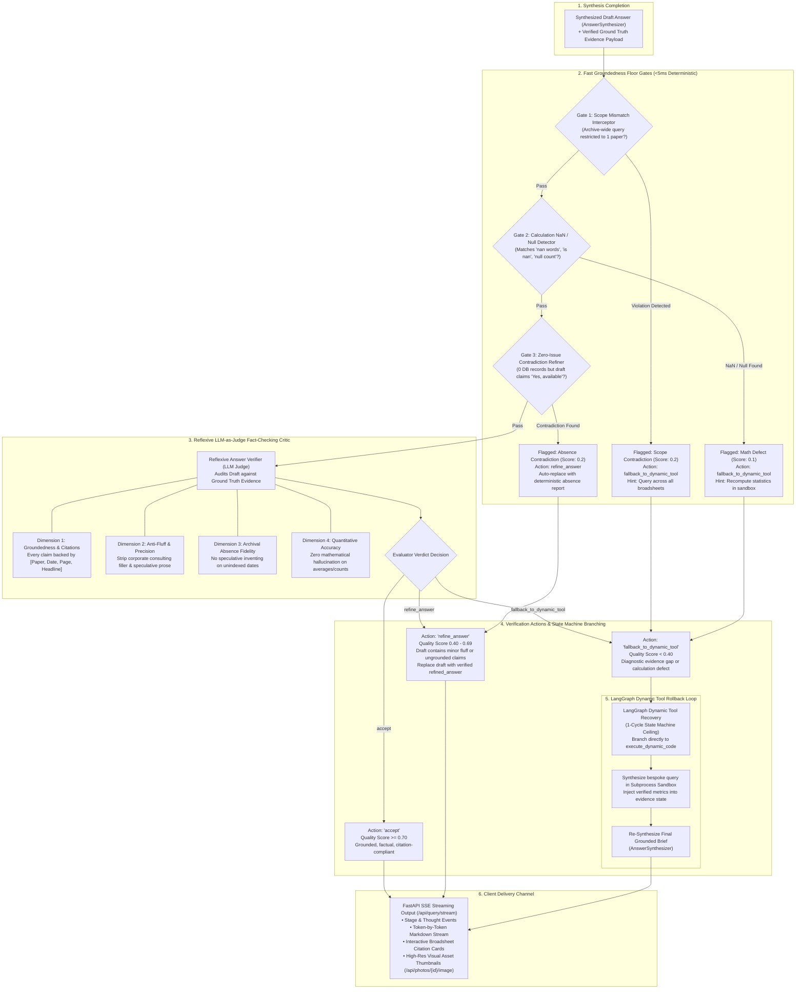

# NewsLens-AI: Complete End-to-End Data Flow & System Architecture

This document serves as the master technical specification for the entire **NewsLens-AI** data pipeline. It unifies all data flows, state transitions, transformation matrices, subsystem boundaries, and execution sequences—tracking broadsheet newspaper PDFs from intake, computer vision, and spatial layout extraction, through multi-tier persistence, into hybrid vector/relational search, and finally through the LangGraph agentic RAG retrieval, dynamic code synthesis, and synthesis state machine.

---

## 1. High-Level System Architecture & Global Subsystem Topology



---

## 2. Dynamic Model Provider Registry & Sovereign / Cloud Architecture

NewsLens-AI decouples application pipelines from hardcoded AI vendors using a **Hot-Swappable Provider Registry Architecture** ([`backend/app/providers/registry.py`](file:///Users/piyushgoel/Downloads/Projects/NewsLens-AI/backend/app/providers/registry.py)) managed by [`model_config.yaml`](file:///Users/piyushgoel/Downloads/Projects/NewsLens-AI/model_config.yaml) and the frontend **Model Settings Studio** ([`frontend/src/components/ModelSettingsStudio.jsx`](file:///Users/piyushgoel/Downloads/Projects/NewsLens-AI/frontend/src/components/ModelSettingsStudio.jsx)).

```
┌─────────────────────────────────────────────────────────────────────────────────────────────────┐
│                                 DYNAMIC MODEL PROVIDER REGISTRY                                 │
├──────────────────────────────┬───────────────────────────────┬──────────────────────────────────┤
│ Tier 1: Local Sovereign      │ Tier 2: Google Gemini Cloud   │ Tier 3: Multi-Provider Gateways │
│ (100% On-Premise / Offline)  │ (Google AI Studio Primary)    │ (Commercial Gateways & Fallbacks)│
├──────────────────────────────┼───────────────────────────────┼──────────────────────────────────┤
│ • Ollama Llama 3.1 8B        │ • Google Gemini 2.5 Flash     │ • OpenAI GPT-4o & GPT-4o-mini    │
│ • Ollama DeepSeek R1 14B     │   (Workhorse VLM, Plan, Synth)│ • OpenRouter (Gemma 4, Nemotron) │
│ • Ollama Qwen 2.5 VL / 3 VL  │ • Google Gemini 2.5 Pro       │ • NVIDIA NIM Catalog             │
│ • Docling Layout + RapidOCR  │   (Frontier Reasoning/Synthesis│ • Google Cloud Vision OCR        │
│ • BAAI/bge-m3 (1024d Dense)  │ • Google Gemini 2.5 Flash-Lite│ • Text-Embedding-3-Large         │
│                              │ • Transparent Model Failover  │ • HTTP 429 Cooldown Circuit Breaker
└──────────────────────────────┴───────────────────────────────┴──────────────────────────────────┘
```

### Granular Pipeline Task Bindings
1. **Stage 1 — Agentic Reasoning & Synthesis**:
   - `query_planner`: Autonomous tool sequence planner & sub-query generator (`gemini-3.8-flash` / `ollama_llama3`).
   - `answerer`: Multi-newspaper factual synthesizer & citation linker (`gemini-3.8-flash` / `ollama_llama3`).
   - `answer_verifier`: Reflective fact-checking critic and fluff eliminator (`gemini-3.8-flash` / `ollama_llama3`).
   - `query_condenser`: Coreference and pronoun resolution (`gemini-3.8-flash` / `ollama_llama3`).
2. **Stage 2 — Vision & Broadsheet Ingestion**:
   - `visual_extraction`: Multimodal chart, table, and scene extractor (`gemini-3.8-flash` / `ollama_qwen3vl`).
   - `layout_analysis`: 2D spatial layout and column parsing (`gemini-3.8-flash` / `docling_parser`).
   - `document_parser`: Broadsheet hierarchy structure extractor (`docling_parser`).
   - `ocr`: Character transcription engine (`rapidocr` / `docling`).
3. **Stage 3 — Classification & Indexing**:
   - `embedding`: 1024-dimensional dense vector generator (`local_embed_bge` - BAAI/bge-m3).
   - `article_segmentation`: Complex multi-column jump-line stitcher (`gemini-3.8-flash` / `ollama_deepseek`).
   - `classification`: 12-domain probabilistic categorization (`gemini-3.8-flash` / `ollama_llama3`).
   - `metadata_extraction`: Publication, edition, and date extractor (`gemini-3.8-flash` / `ollama_llama3`).

---

## 3. Document Intake & Broadsheet Ingestion Pipeline Data Flow

The ingestion pipeline processes complex 2D newspaper broadsheet scans through six sequential phases:

```
[ Broadsheet PDF / Archive Upload ]
               │
               ▼
┌────────────────────────────────────────────────────────────────────────┐
│ Phase 1: Intake, Compression & SHA-256 Idempotency                     │
│ • Compress raw PDF with Ghostscript / fitz.deflate                     │
│ • Calculate SHA-256 hash; verify against `issues` table                │
│ • Upload raw PDF to MinIO bucket `newslens-originals`                  │
└──────────────────────────────────┬─────────────────────────────────────┘
                                   │
                                   ▼
┌────────────────────────────────────────────────────────────────────────┐
│ Phase 2: Visual Masthead Verifier & Multi-Page Folio Consensus         │
│ • Crop top 22% of Page 1; run RapidOCR ONNX (<0.6s)                    │
│ • Normalize Unicode superscripts (e.g. ²⁷⁰⁸²⁰²⁶ ➔ 27082026)            │
│ • Evaluate broadsheet brand patterns against dynamic registry          │
│ • Run multi-page folio consensus (5x header-zone weight over Pages 1-15)│
│ • Create/update `Issue` record in MySQL (newspaper_id, issue_date)     │
└──────────────────────────────────┬─────────────────────────────────────┘
                                   │
                                   ▼
┌────────────────────────────────────────────────────────────────────────┐
│ Phase 3: 300 DPI High-Res Rasterization & Digital Triage               │
│ • PyMuPDF renders 300 DPI high-resolution PNGs (fitz.Matrix(300/72))   │
│ • Upload page rasters to MinIO bucket `newslens-pages`                 │
│ • PDF Page Detector evaluates text density, vector lines, scanned print│
└──────────────────────────────────┬─────────────────────────────────────┘
                                   │
                                   ▼
┌────────────────────────────────────────────────────────────────────────┐
│ Phase 4: 5-Pass Spatial Layout Analysis & 2D Article Segmentation      │
│ • Pass 0: Drop-cap initial re-attachment & font ligature repair        │
│ • Pass 1: Vertical paragraph stitching within column tracks            │
│ • Pass 2: Horizontal multi-column headline slice merging               │
│ • Pass 3: Statutory ad-envelope boundary wall detection                │
│ • Pass 4: Cross-page jump-line stitching ("Continued on Page 4")       │
└──────────────────────────────────┬─────────────────────────────────────┘
                                   │
         ┌─────────────────────────┴─────────────────────────┐
         │                                                   │
         ▼                                                   ▼
┌──────────────────────────────────────┐    ┌──────────────────────────────────────┐
│ Phase 5A: Text Assembly & Order      │    │ Phase 5B: Visual Asset Harvesting    │
│ • 2D Reading Order Graph (x, y, col) │    │ • Crop photos, logos, charts, tables │
│ • Column de-bundling (Shorts/Briefs) │    │ • Spatial containment binding        │
│ • Kicker extraction & bylines        │    │ • Visual triage (Photo vs Data Chart)│
│ • Cross-page jump-line stitching     │    │ • Dual VLM + Spatial OCR Matrix      │
└──────────────────┬───────────────────┘    └──────────────────┬───────────────────┘
                   │                                           │
                   └─────────────────────┬─────────────────────┘
                                         │
                                         ▼
┌────────────────────────────────────────────────────────────────────────┐
│ Phase 6: Probabilistic 12-Domain Classification & Contextual Chunking  │
│ • Weighted scoring: Headline (3x), Subheadline (2x), Body text (1x)    │
│ • Domain Context Anchor Dampening for financial/political metaphors    │
│ • Secondary Topic Extraction; persist in `Topic` & `ArticleTopic`      │
│ • Insert `Article`, `ArticlePage`, `Photo` in MySQL 8                  │
│ • Contextual chunking: Prepend [Newspaper|Date|Sec|Headline|Pages]     │
│ • Embed via BAAI/bge-m3 (1024-dim dense); upsert into Qdrant           │
└────────────────────────────────────────────────────────────────────────┘
```

---

## 4. Visual Asset Intelligence, Multimodal VLM & Failover Data Flow

Broadsheets embed crucial quantitative intelligence inside tables, stock charts, and infographics. NewsLens-AI handles visual data through a resilient 3-stage pipeline with active circuit breaking:



### On-Demand Agent Trigger vs. Ingestion Extraction
- **Ingestion Time**: High-priority data charts and tables receive initial transcription.
- **On-Demand Query Time (`inspect_visual_asset`)**: When an agent query or attached asset (`attached_photo_id`) targets a photo where `vlm_description` is a placeholder, the system streams raw crop bytes from MinIO, executes on-demand VLM transcription, and caches the result back into MySQL.

---

## 5. Relational Knowledge Graph & Chronological Storyline Trajectories



### Storyline Trajectory Construction
1. Articles mentioning an entity or theme are clustered across publication dates.
2. The `TimelineBuilder` calculates narrative arcs, milestone events, and prominence scores.
3. Chronological milestone graphs are cached in Redis with a 1-hour TTL and rendered on the client as an interactive visual storyline canvas.

---

## 6. Multi-Tier Storage Layer Architecture & Data Lifecycle Matrix

| Layer | Component | Engine / Driver | Stored Data & Schema | Access Patterns & Indexing |
|---|---|---|---|---|
| **System of Record** | Relational Database | **MySQL 8** (`aiomysql` / SQLAlchemy 2) | • `newspapers`, `issues`, `pages`<br/>• `articles`, `article_pages`<br/>• `photos`, `tables`<br/>• `entities`, `article_entities`<br/>• `topics`, `article_topics`<br/>• `query_log`, `ingestion_jobs` | • Foreign keys & relational joins<br/>• `FULLTEXT(headline, full_text)`<br/>• B-tree indexes on `(newspaper_id, issue_date)`<br/>• Sub-5ms metadata queries |
| **Vector Store** | Dense Vector DB | **Qdrant** (`qdrant-client`) | • Collection: `article_chunks`<br/>• 1024-dim dense vectors (`BAAI/bge-m3`)<br/>• Payload: `article_id`, `issue_id`, `newspaper_name`, `issue_date`, `page_number`, `headline`, `section`, `has_visual_data`, `bboxes` | • Cosine similarity search (HNSW index)<br/>• Payload pre-filtering on `newspaper_name`, `issue_date`, `section`<br/>• Sub-15ms vector retrieval |
| **Object Store** | S3-Compatible Blob Store | **MinIO** (`minio-py`) | • Bucket `newslens-originals`: Raw source PDFs<br/>• Bucket `newslens-pages`: 300 DPI high-res page rasters<br/>• Cropped visual assets & chart PNGs | • High-throughput binary streaming<br/>• Public thumbnail HTTP endpoints (`/api/photos/{id}/image`)<br/>• Immutable asset storage |
| **In-Memory Cache** | Key-Value & Queue | **Redis 7** (`redis-py`) | • Celery background worker task queue<br/>• Query response cache (TTL: 1h)<br/>• Condensed query hash cache<br/>• Timeline trajectory cache<br/>• SSE Pub/Sub channels | • In-memory sub-millisecond lookups<br/>• Distributed task locks (`redis-lock`)<br/>• Automatic TTL expiration (1h to 24h) |

---

## 7. Conversational Agent Query Lifecycle & LangGraph Execution Sequence



---

## 8. Query Planner & Dynamic Answer Blueprint Data Flow



### The 7 Core Broadsheet Query Archetypes & Routing Matrix

| Archetype | Journalistic Intent | Primary Planned Tools | Typical Parameter Payload | Downstream Output Format |
|---|---|---|---|---|
| **`factual_lookup`** | Point-in-time facts, quotes, event details, or visual checks | `hybrid_search` (primary), `inspect_visual_asset` (if visual) | `query`, `newspaper_name`, `date_from`, `date_to`, `page_filter`, `top_k=6` | Direct narrative findings + bulleted operational details + citations |
| **`article_catalog`** | Whole-issue manifests, section catalogs, front-page listings | `sql_analytics` (`analysis_type="issue_summary"`) | `newspaper_name`, `issue_date`, `category_filter`, `page_filter` | Markdown manifest table (`#`, Headline, Page, Section, Byline) + featured highlights |
| **`cross_newspaper_comparison`** | Multi-broadsheet coverage diffs, exclusive stories, or shared wire news | `sql_analytics` (`coverage_difference` or `shared_coverage`) + `hybrid_search` | `newspaper_name`, `comparison_newspaper`, `issue_date`, `query`, `top_k=12` | Cross-newspaper comparison matrix table + editorial framing divergence bullets |
| **`thematic_timeline`** | Chronological evolution of developing storylines across editions | `timeline_builder` (primary), `hybrid_search` (corroborating) | `query`, `limit=25`, `top_k=8` | Chronological dated milestone timeline + trajectory narrative |
| **`quantitative_trend`** | Volume metrics, publication rosters, issue counts, ad counts | `sql_analytics` (`count_issues`, `count_articles`, `count_advertisements`, `count_photos`) | `analysis_type`, `newspaper_name`, `date_from`, `date_to`, `issue_date` | Direct authoritative findings + compact metric cards |
| **`entity_deep_dive`** | Multi-hop relational entity networks, corporate profiles, salience | `entity_search` (primary), `hybrid_search` (corroborating) | `entity_name`, `top_k=10` | Executive profile + corporate actions bullets + media scrutiny narrative |
| **`negative_coverage_audit`** | Verifying silence or absence of coverage across the broadsheet archive | `coverage_analysis` (primary), `sql_analytics` (secondary) | `query`, `target_date`, `newspaper_name` | 3-tier coverage matrix table (Primary, Corroborating, Omission verdict) |
| **`analytical_computation`** *(Special)* | Ad-hoc statistics, averages, length distributions, ratios, joins | `dynamic_analysis` (synthesized Python/SQL sandbox) | `query`, `analysis_description` | Computed mathematical metrics + verified tabular statistics |

### Strict Operational Contracts
- **`sql_analytics` Contract**: Bound strictly to 7 immutable routines. Cannot execute arbitrary SQL; cannot compute averages or ratios. Unsupported analytics hand off directly to `dynamic_analysis`.
- **`dynamic_analysis` Contract**: Bound to mathematical aggregations, averages, and multi-table joins. Barred from narrative reading where word count is an answer length constraint (`is_dynamic_analysis_permitted`).

---

## 9. 4-Tier Journalistic Web Search Grounding Data Flow

```
┌────────────────────────────────────────────────────────────────────────┐
│                  USER QUERY REQUIRING LIVE WEB GROUNDING               │
└──────────────────────────────────┬─────────────────────────────────────┘
                                   │
                                   ▼
┌────────────────────────────────────────────────────────────────────────┐
│ Tier 1: NewsData.io Accredited News API (Primary Journalistic Engine)  │
│ • Queries accredited global and national press agencies                │
│ • Parameters: `q={query}`, `country=in`, `language=en`, `category`     │
│ • Delivers structured publisher `source_name`, `pubDate`, and deep url │
└──────────────────────────────────┬─────────────────────────────────────┘
                                   │
                     ┌─────────────┴─────────────┐
                     │ (Success: >= 1 Article)   │ (Empty / Rate Limited / Error)
                     ▼                           ▼
       ┌───────────────────────────┐ ┌───────────────────────────────────┐
       │ Structured News Evidence  │ │ Tier 2: Serper API (Google Search)│
       └───────────────────────────┘ └─────────────────┬─────────────────┘
                                                       │
                                         ┌─────────────┴─────────────┐
                                         │ (Success)                 │ (Empty / Error)
                                         ▼                           ▼
                           ┌───────────────────────────┐ ┌───────────────────────┐
                           │ Google SERP Snippets      │ │ Tier 3: Tavily API    │
                           └───────────────────────────┘ └───────────┬───────────┘
                                                                     │
                                                       ┌─────────────┴───────────┐
                                                       │ (Success)               │ (Empty / Error)
                                                       ▼                         ▼
                                         ┌─────────────────────────┐ ┌───────────────────┐
                                         │ Tavily Research Context │ │ Tier 4: DuckDuckGo│
                                         └─────────────────────────┘ └───────────────────┘
```

| Search Tier | Provider | Primary Strength | Metadata Extracted |
|---|---|---|---|
| **Tier 1 (Primary)** | **NewsData.io** (`newsdataapi`) | Accredited broadsheets & news agencies (Reuters, Mint, The Hindu, PTI) | `title`, `source_name`, `pubDate`, `link`, `description`, `category` |
| **Tier 2 (Fallback)** | **Serper API** | High-index Google Web Search results | `title`, `snippet`, `link`, `date` |
| **Tier 3 (Fallback)** | **Tavily Search** | AI agent research engine optimized for RAG synthesis | `title`, `content`, `url`, `score` |
| **Tier 4 (Offline)** | **DuckDuckGo** | Zero-credential, zero-cost fallback HTML scraper | `title`, `snippet`, `link` |

---

## 10. Broadsheet Reader to Agent Visual Attachment Data Flow

When a user reads a newspaper in the interactive **Broadsheet Reader** and encounters a complex visual graphic, chart, or photo, they can route that specific asset directly into the **Agent Assistant** for deep multimodal inquiry.



### Lifecycle & Anti-Leakage Guardrails
1. **Interactive Attachment Banner**: `AgentAssistant.jsx` displays an active blue attachment chip above chat input with headline, thumbnail, date, and dismiss button.
2. **First-Turn Binding**: `attached_article_id` and `attached_photo_id` bind to tool arguments (`photo_id`, `article_id`).
3. **Cross-Turn Parameter Purge**: On subsequent turns, if the user asks an unrelated question or switches topics, Guardrails 1, 2, and 3 immediately purge visual parameters, preventing cross-turn context contamination.
4. **Cross-Date Asset Conflict Eviction**: If the user's query explicitly specifies a publication date that conflicts with the attached asset's date, the attached asset is evicted. In `executor.py`, `effective_date = explicit_query_date or asset_date` guarantees that attached assets can never overwrite explicit query dates.

---

## 11. Dynamic Tool Synthesis, Subprocess AST Sandbox & Closed-Loop ToolCritic Flow

When broadsheet analytical queries require bespoke aggregations, variances, or relational calculations that exceed predefined static tools, NewsLens-AI dynamically synthesizes, audits, and executes custom Python functions in a secure, sandboxed subprocess with automated self-refinement.



### AST Whitelist and Sandbox Isolation Parameters
- **AST Safety Scanner (`ASTSafetyScanner`)**: Blocks unauthorized modules (`os`, `sys`, `subprocess`, `shutil`, `socket`, `urllib`, `requests`, `pathlib`) and dangerous built-ins (`eval`, `exec`, `open`, `compile`, `__import__`, `globals`, `locals`).
- **Subprocess Sandbox (`sandbox_runner.py`)**: Spawns isolated worker via `subprocess.Popen([sys.executable])`, enforcing 15-second timeout, 512MB RAM ceiling, autocommit disabled, and unconditional `connection.rollback()`.
- **ToolCritic 5-Metric Scorecard**:
  1. **SASC**: Syntactic & AST Security Compliance.
  2. **SRF**: SQL Schema Fidelity (remaps hallucinated columns, requires `DISTINCT` on multi-table joins).
  3. **REH**: Runtime Subprocess Health (zero exit code, no exceptions).
  4. **DSF**: Data-to-Summary Faithfulness (legitimate absence vs. narrative hallucination; accepts aggregate tables).
  5. **RPS**: Intent Alignment & Filter Plausibility (ISO date validation).

---

## 12. Corrective RAG (CRAG), Answer Verification & Streaming Delivery Flow

The post-retrieval verification pipeline in NewsLens-AI ensures that every synthesized brief is factually accurate, citation-grounded, and free of hallucinations before reaching the user. It operates as a two-stage closed-loop quality gate:
1. **Corrective RAG (CRAG) Evidence Evaluation (`evaluator.py`)**: Intercepts retrieved tool evidence before synthesis. It evaluates qualitative and quantitative sufficiency, catches legitimate archival absences, and dynamically routes deficient queries into adaptive static re-planning or sandboxed ad-hoc tool synthesis.
2. **Reflective LLM Answer Verification (`answer_verifier.py`)**: Audits the synthesized draft response against raw database ground truth. It applies sub-5ms deterministic scope and math checks, followed by an LLM-as-judge fact-checker that strips fluff, refines ungrounded statements, or triggers a dynamic tool rollback loop.

### 12.1. CRAG Evidence Evaluation & Adaptive Fallback Routing Flowchart



### 12.2. Reflective LLM Answer Verifier & Editorial Critic Gate Flowchart



### 12.3. Key Technical Invariants in Post-Retrieval Verification
1. **The Fast-Floor Optimization**: If retrieval already fetched `>= 1` broadsheet record with `>= 100` words of clean editorial body text and prominence `>= 0.65`, the system immediately passes to synthesis (`<5ms` latency), eliminating unnecessary LLM-as-judge calls for clean factual queries.
2. **Legitimate Archival Absence vs. Hallucination**: When a query asks for broadsheet availability on an unindexed date (e.g., Sunday) and the database returns 0 issues, the evaluator recognizes this as legitimate absence (`score = 0.85`), preventing false positive retries and instructing the synthesizer to state the absence authoritatively.
3. **Adaptive Static Re-Planning Safeguards**: When `replan_static_tools` triggers, narrow page or category constraints are purged, date ranges are widened, and `top_k` expands (`max(8, k+4)`). An anti-repetition filter guarantees the planner never re-runs identical tool configurations.
4. **LangGraph Dynamic Tool Rollback Ceiling**: If the `AnswerVerifier` detects a critical mathematical or comparative evidence gap, it triggers a 1-cycle rollback into `execute_dynamic_code`. The engine synthesizes, executes, and audits a bespoke Python tool in the AST sandbox before generating the final verified response. A strict 1-cycle counter prevents infinite fallback loops.

---

## 13. Failure Modes, Circuit Breakers & Resilience Matrix

| Failure Scenario | Trigger Detection | Immediate Mitigation | Ultimate Safety Net |
|---|---|---|---|
| **Cloud VLM Rate Limit** | Gemini / OpenRouter returns HTTP 429 (`RateLimitExhaustedError`) | `trip_circuit_breaker(60.0)` activates; subsequent requests bypass failing provider; immediate failover to **`google_cloud_vision`** / **`ollama_qwen3vl`** | **Deterministic Spatial OCR Matrix Engine** reconstructs tabular data from token coordinates; zero ingestion abort |
| **Malformed VLM Output** | VLM returns conversational text instead of structured JSON | Regex extraction of Markdown table blocks (`extract_markdown_table_from_raw_text`) | Deterministic OCR text density fallback |
| **Low-Confidence OCR** | Poor print quality, bleed-through, or broken text on old broadsheets | Consensus multi-page folio voting across Pages 1–15; RapidOCR ONNX with Unicode superscript normalization | Minimum confidence threshold filter; human verification flag in DB |
| **Zero Retrieval Hits** | Query mentions unindexed historical date or outside broadsheet scope | Evidence Relevance Gate detects 0 grounded chunks; triggers fallback web search via NewsData.io | Enforces strict Anti-Hallucination notice; explicitly states zero archival evidence found |
| **Unforeseen Analytics / Unsupported Parameters** | Query asks for custom metrics (page counts, size distribution) exceeding static tools | Layer 1 intercepts unsupported parameter and hands off to `dynamic_analysis`; Layer 2 CRAG invokes `ToolMaker` | Synthesizes ad-hoc tool; executes safely in subprocess AST Sandbox with 15s timeout, 512MB RAM cap, and read-only rollback |
| **Hallucinated Columns / Cartesian Joins in Dynamic Tools** | Generated tool queries non-existent columns (`published_at`) or joins without `DISTINCT` | `ToolCritic` SRF metric detects schema violations; re-prompts LLM with structured diagnostic critique | Bounded 3-retry loop with token-budgeted trace; enforces relational schema fidelity before evidence injection |
| **Statistical Metric Absence / Failed Analytics** | Query asks for variance, std dev, or complex ratios but tool fails or returns empty | Synthesizer detects absence of computed numbers in verified tool evidence | `QUANTITATIVE & STATISTICAL METRIC ABSENCE HARD-STOP` strictly forbids hallucinating numbers, truthfully reporting computation unavailability |
| **Cross-Date Asset / Stale Context Leakage** | User switches dates across multi-turn session with active attached asset | Query condenser and graph routers detect date conflict and prune attached asset | Executor strictly enforces `effective_date = explicit_query_date`, preventing queries against mismatched issues |
| **Network Outage / Cloud Down** | All external APIs (OpenRouter, Gemini, OpenAI) unreachable | Model Settings Studio switches to **Local Sovereign Preset** | 100% offline air-gapped execution via Ollama (Llama 3.1, DeepSeek R1, Qwen 3 VL), Docling, and local BGE-M3 |

---

*End of NewsLens-AI Complete End-to-End Data Flow & System Architecture Specification.*
