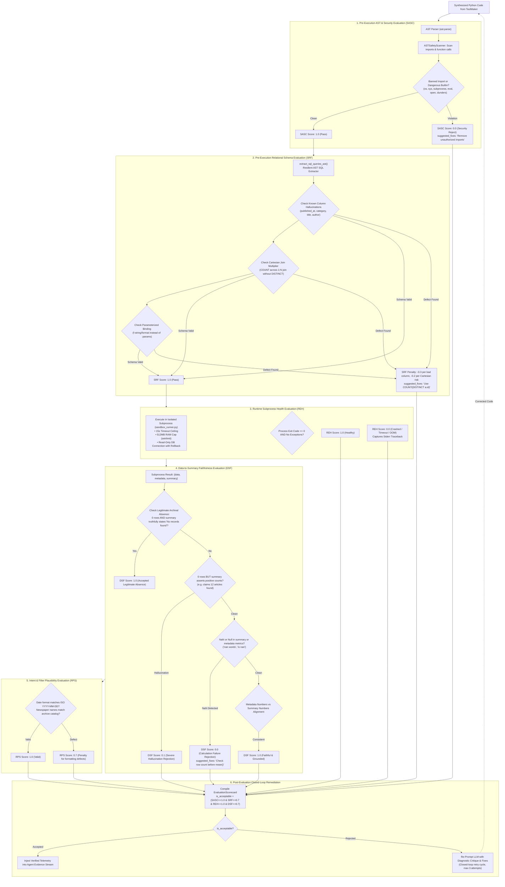
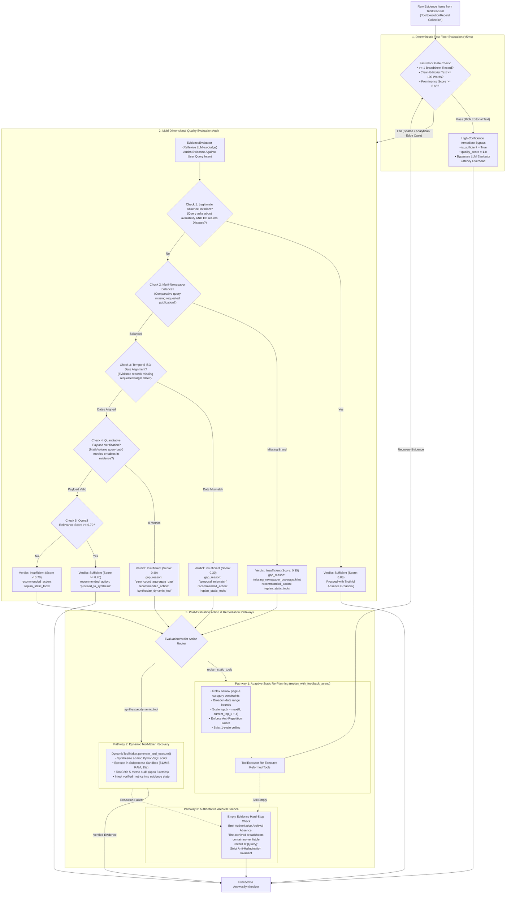
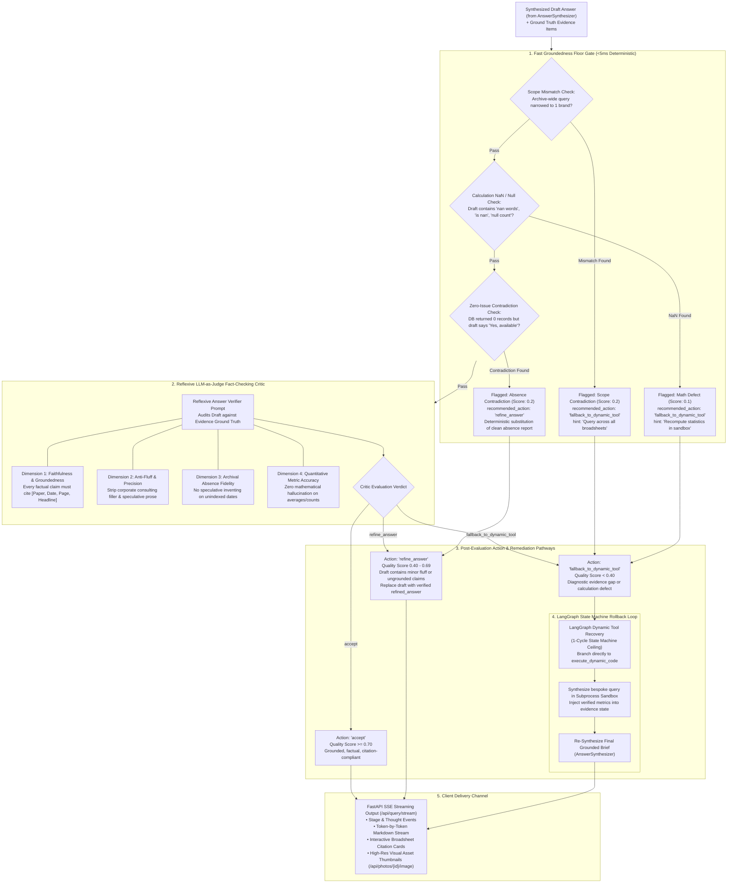

# NewsLens-AI: Hallucination Prevention, Multi-Stage Evaluation & Corrective RAG (CRAG) Architecture

This document provides an exhaustive, production-grade architectural specification for **Hallucination Prevention, Multi-Stage Pipeline Evaluation, Corrective RAG (CRAG), ToolCritic Code Auditing, and Closed-Loop Fallback Recovery** in **NewsLens-AI**. It details where and when evaluations occur across the pipeline lifecycle, what dimensions are audited (such as **Recall**, **Faithfulness**, **Relational Schema Fidelity**, **Subprocess Health**, and **Absence Grounding**), and exactly what self-correcting actions are executed after each evaluation.

---

## 1. The Broadsheet Intelligence Threat Model

Retrieval-Augmented Generation (RAG) over historical print newspapers presents unique hallucination risks that conventional conversational RAG systems fail to handle:

```
┌────────────────────────────────────────────────────────────────────────────────────────┐
│                          BROADSHEET HALLUCINATION THREAT MATRIX                        │
├──────────────────────────┬────────────────────────────┬────────────────────────────────┤
│ Hallucination Category   │ Manifestation Failure      │ Real-World Broadsheet Example  │
├──────────────────────────┼────────────────────────────┼────────────────────────────────┤
│ **Relational Schema**    │ Model invents non-existent │ Querying `articles.published_at`│
│                          │ columns or joins           │ instead of `issues.issue_date`. │
├──────────────────────────┼────────────────────────────┼────────────────────────────────┤
│ **Cartesian Explosion**  │ Unconstrained 1:N joins    │ Joining articles & photos with │
│                          │ multiply count metrics     │ `COUNT(a.id)`, inflating count │
│                          │ by 5x to 20x               │ from 12 to 180 articles.       │
├──────────────────────────┼────────────────────────────┼────────────────────────────────┤
│ **Absence Contradiction**│ Model asserts positive     │ DB returns 0 issues on Sunday; │
│                          │ availability when the      │ LLM says: "Yes, at least one   │
│                          │ archive contains 0 records │ issue is available on that date"│
├──────────────────────────┼────────────────────────────┼────────────────────────────────┤
│ **Publication Narrowing**│ Archive-wide query is      │ User asks: "List all papers in │
│                          │ artificially restricted to │ July"; LLM narrows to solely   │
│                          │ a single favorite brand    │ "The Goan" or "The Hindu".     │
├──────────────────────────┼────────────────────────────┼────────────────────────────────┤
│ **Mathematical / NaN**   │ Model computes `NaN` on    │ Dividing by 0 on empty sets    │
│                          │ empty sets or invents      │ yields `NaN words`; model prints│
│                          │ plausible averages         │ "Average word count is NaN".   │
├──────────────────────────┼────────────────────────────┼────────────────────────────────┤
│ **Context Contamination**│ Multi-turn session carries │ User attached a photo from Aug │
│                          │ forward stale asset date   │ 5, then asks about Aug 1; model│
│                          │ or headline across dates   │ retrieves the wrong story.     │
├──────────────────────────┼────────────────────────────┼────────────────────────────────┤
│ **Speculative Fluff**    │ Empty archive triggers     │ "Investigate implications on   │
│                          │ management consulting      │ overall content strategy and   │
│                          │ boilerplate filler         │ editorial publication plans."  │
└──────────────────────────┴────────────────────────────┴────────────────────────────────┘
```

---

## 2. Master Evaluation Lifecycle Architecture

In NewsLens-AI, evaluation is not a monolithic final check. Instead, evaluations occur at **four distinct checkpoints** in the query lifecycle, each specialized for its stage:

```mermaid
flowchart TD
    UserQuery["User Query + Multi-Turn Context"] --> Stage1

    subgraph Stage1 ["Stage 1: Planning-Time Contract Evaluation"]
        P1["Parameter Extraction Validation (extractor.py)"]
        P2["Static Broadsheet Schema Contract (STATIC_BROADSHEET_SCHEMA)"]
        P3["Column Remapping Gate (KNOWN_COLUMN_HALLUCINATIONS)"]
        P4["Dynamic Analysis Permission Check (is_dynamic_analysis_permitted)"]
        P5["Strict 7-Enum Negative Constraints (sql_analytics)"]
    end

    Stage1 --> ToolExec["Concurrent Tool Execution Engine (executor.py)"]
    ToolExec --> DynamicBranch{"Tool Type"}

    DynamicBranch -->|"dynamic_analysis"| Stage2
    DynamicBranch -->|"Static Tools (hybrid, sql, entity, etc.)"| Stage3

    subgraph Stage2 ["Stage 2: Dynamic Tool Code & Execution Evaluation (tool_critic.py)"]
        C1["SASC: Syntactic & AST Security Audit"]
        C2["SRF: Schema Fidelity & Cartesian Product Audit"]
        C3["REH: Subprocess Runtime Health & Memory Limit"]
        C4["DSF: Data-to-Summary Faithfulness & NaN Audit"]
        C5["RPS: Intent Alignment & Filter Plausibility"]
        C6["Post-Eval Action: 3-Retry Closed-Loop Code Refinement"]
    end

    Stage2 --> Stage3

    subgraph Stage3 ["Stage 3: Post-Retrieval CRAG Evidence Evaluation (evaluator.py)"]
        E1["Fast-Floor Gate (<5ms for >= 100 Words Editorial Text)"]
        E2["Lexical & Semantic Recall Scoring (Stemming + Stopwords)"]
        E3["Legitimate Absence Discrimination Invariant"]
        E4["Comparative Multi-Newspaper Balance Audit"]
        E5["Temporal ISO Date Alignment Audit"]
        E6["Quantitative Payload Verification"]
        E7["Post-Eval Action: replan_static_tools / synthesize_dynamic_tool"]
    end

    Stage3 --> Synthesis["Blueprint-Driven Grounded Synthesis (synthesizer.py)"]
    Synthesis --> Stage4

    subgraph Stage4 ["Stage 4: Post-Synthesis Answer Verification (answer_verifier.py)"]
        V1["Fast Groundedness Floor Gate (<5ms Deterministic Checks)"]
        V2["Scope Mismatch Interceptor"]
        V3["Calculation NaN / Null Detector"]
        V4["Zero-Issue Contradiction Refiner"]
        V5["Reflexive LLM Fact-Checking Critic (4 Dimensions)"]
        V6["Post-Eval Action: accept / refine_answer / rollback loop"]
    end

    Stage4 --> VerifiedSSE["Verified, Factual SSE Stream Delivered to Client"]
```



---

## 3. Evaluation Times, Places, Audited Dimensions & Remediation

The table below outlines every evaluation performed in the platform, specifying **where** in the code it resides, **when** in the query lifecycle it executes, **what** metrics and dimensions it audits, and **what action is taken after evaluation**:

| Evaluation Stage | Component & File | Lifecycle Execution Time | Audited Dimensions & Metrics | Trigger Condition | Post-Evaluation Action & Remediation |
|---|---|---|---|---|---|
| **1. Planning Contracts** | `extractor.py`, `planner.py`, `archive_context.py` | Query Ingestion (Pre-Execution) | • Parameter format & ISO regex<br/>• Typo-tolerant brand normalization<br/>• Static schema bounds<br/>• Dynamic analysis permission | Non-ISO date, brand typo, or unsupported aggregation | Automatically normalizes dates; replaces column aliases; restricts narrative reading from dynamic code synthesis. |
| **2. AST & Security** | `sandbox.py`, `tool_maker.py` | Tool Synthesis (Pre-Execution) | • **SASC**: Banned modules (`os`, `sys`, `subprocess`)<br/>• Dangerous builtins (`eval`, `exec`, `open`)<br/>• Dunder attribute traversal | Banned import or built-in function detected | Score set to 0.0; execution aborted; re-prompts LLM with AST security violation critique. |
| **3. SQL Schema Fidelity** | `tool_critic.py` (`audit_sql_schema`) | Dynamic Tool Synthesis (Pre-Execution) | • **SRF**: Relational schema conformance<br/>• Known column hallucinations<br/>• Cartesian joins (`COUNT` without `DISTINCT`) | Non-existent column or unconstrained 1:N join | Re-prompts LLM with schema critique and recommended fixes (e.g. use `COUNT(DISTINCT a.id)`). |
| **4. Subprocess Runtime Health** | `tool_critic.py`, `sandbox_runner.py` | Dynamic Tool Execution (Runtime) | • **REH**: Exit codes, stdout/stderr<br/>• 15s process timeout<br/>• 512MB RAM ceiling (`setrlimit`) | Subprocess crash, timeout, or OOM | Score set to 0.0; captures stderr trace; re-prompts LLM with runtime traceback for self-correction. |
| **5. Data-to-Summary Faithfulness** | `tool_critic.py` (`audit_data_to_summary`) | Dynamic Tool (Post-Execution) | • **DSF**: Internal consistency<br/>• Positive count claims over 0 rows<br/>• Unhandled `NaN` or `null` metrics<br/>• Tabular alignment with metadata | Summary claims rows when DB returned 0, or emits `NaN` | Rejects summary (score 0.0–0.1); forces re-prompt with NaN-handling instructions or truthful absence reporting. |
| **6. Retrieval Recall & Substance** | `evaluator.py` (`_score_relevance`) | Post-Tool Retrieval (Pre-Synthesis) | • Lexical keyword recall & stemming<br/>• Stopword filtering<br/>• Editorial text depth (>= 100 words)<br/>• Prominence score (>= 0.65) | Fast-floor criteria satisfied | Bypasses LLM evaluation latency (<5ms) and immediately advances high-confidence broadsheet text to synthesis. |
| **7. CRAG Evidence Sufficiency** | `evaluator.py` (`evaluate_evidence`) | Post-Tool Retrieval (Pre-Synthesis) | • Multi-newspaper balance<br/>• Temporal ISO date alignment<br/>• Quantitative payload completeness<br/>• Legitimate absence invariant | Missing publication, missing date, or 0 metrics on quant query | Emits typed `EvaluationVerdict`: triggers `replan_static_tools` (widen dates/filters, scale `top_k`) or `synthesize_dynamic_tool`. |
| **8. Fast Groundedness Floor** | `answer_verifier.py` (`_fast_groundedness_check`) | Post-Synthesis (Pre-Delivery) | • Scope mismatch (archive vs brand)<br/>• Calculation `NaN` / `null` in draft<br/>• Zero-issue contradiction in draft | Relational 0 contradicted by "Yes, available" or NaN emitted | Intercepts draft (<5ms): auto-replaces with clean absence report (`refine_answer`) or triggers dynamic tool rollback. |
| **9. Reflective Editorial Audit** | `answer_verifier.py` (`verify_answer_async`) | Post-Synthesis (Pre-Delivery) | • **Faithfulness & Groundedness**<br/>• **Freedom from Fluff**<br/>• **Archival Absence Fidelity**<br/>• **Quantitative Accuracy** | Factual error, corporate fluff, or missing citations | Emits `accept`, `refine_answer` (substitutes cleaned grounded brief), or `fallback_to_dynamic_tool` (LangGraph rollback). |

---

## 4. Deep Dive: Dynamic Tool Evaluation (`ToolCritic`)

Located in [`backend/app/agent/tool_critic.py`](file:///Users/piyushgoel/Downloads/Projects/NewsLens-AI/backend/app/agent/tool_critic.py).

When ad-hoc queries require runtime Python and SQL generation, the code is evaluated across **five quantitative dimensions** before any results are accepted into the agent's evidence stream:



### The "Legitimate Absence" Discrimination Invariant
A key innovation in NewsLens-AI is the ability of the evaluator to distinguish between a **failed query** and a **legitimate archival absence**:
- **Legitimate Archival Absence**: A database query for issues on Sunday returns 0 rows. The dynamic tool summary states: *"No newspaper issues were published or archived for 2026-04-28."* The `ToolCritic` scores this as **`DSF = 1.0 (Accepted)`**.
- **Hallucinated Positive Assertion**: The database query returns 0 rows. The summary states: *"The archive contains 14 articles covering state politics."* The `ToolCritic` detects that positive counts are claimed over empty rows and scores this as **`DSF = 0.1 (Severe Hallucination Rejection)`**, triggering an automated code regeneration cycle.

---

## 5. Deep Dive: Corrective RAG (CRAG) Evidence Evaluation (`EvidenceEvaluator`)

Located in [`backend/app/agent/evaluator.py`](file:///Users/piyushgoel/Downloads/Projects/NewsLens-AI/backend/app/agent/evaluator.py).

After tools execute concurrently, the retrieved evidence items pass through the CRAG `EvidenceEvaluator` before prompt assembly:



---

## 6. Deep Dive: Post-Synthesis Answer Verification (`AnswerVerifier`)

Located in [`backend/app/agent/answer_verifier.py`](file:///Users/piyushgoel/Downloads/Projects/NewsLens-AI/backend/app/agent/answer_verifier.py).

Even when evidence is grounded, an LLM synthesizer may still inject unsupported speculative filler, make mathematical errors, or misread relational zero counts. The `AnswerVerifier` serves as the final **editorial critic** before any tokens are streamed to the client:



---

## 7. Closed-Loop Fallback Recovery & Self-Correction Mechanisms

When an evidence gap, retrieval failure, or ungrounded synthesis is detected, NewsLens-AI does not terminate with an error or present speculative prose. It activates **four closed-loop fallback pathways** designed to improve the response iteratively:

```
┌────────────────────────────────────────────────────────────────────────────────────────┐
│                          4-TIER CLOSED-LOOP FALLBACK PATHWAYS                          │
├────────────────────┬─────────────────────────────┬─────────────────────────────────────┤
│ Fallback Pathway   │ Triggering Condition        │ Iterative Self-Correction Applied   │
├────────────────────┼─────────────────────────────┼─────────────────────────────────────┤
│ **Pathway 1:**     │ CRAG detects missing        │ • Relaxes narrow page & section     │
│ **Adaptive Static**│ newspaper or over-          │   filters                           │
│ **Re-Planning**    │ constrained date bounds     │ • Broadens date ranges              │
│                    │                             │ • Dynamically scales                │
│                    │                             │   top_k = max(8, k+4)               │
│                    │                             │ • Anti-repetition guard prevents    │
│                    │                             │   duplicate calls                   │
├────────────────────┼─────────────────────────────┼─────────────────────────────────────┤
│ **Pathway 2:**     │ Query requires calculations │ • Injects validated context & schema│
│ **Dynamic Tool**   │ or static tools return 0    │ • Synthesizes bespoke Python/SQL    │
│ **Synthesis**      │ counts                      │ • ToolCritic audits 5 metrics (3x)  │
│                    │                             │ • Runs in AST Subprocess Sandbox    │
├────────────────────┼─────────────────────────────┼─────────────────────────────────────┤
│ **Pathway 3:**     │ Answer Verifier catches     │ • Emits clean grounded answer       │
│ **In-Flight Answer**│ availability contradiction │   without consulting fluff          │
│ **Refinement**     │ or speculative filler       │ • Injects accurate archive bounds   │
├────────────────────┼─────────────────────────────┼─────────────────────────────────────┤
│ **Pathway 4:**     │ Inquiries outside broadsheet│ • 4-tier live news search cascade   │
│ **External Web &** │ coverage dates or unindexed │ • NewsData.io ➔ Serper ➔ Tavily ➔   │
│ **Truthful Silence**│ archival absence           │   DuckDuckGo                        │
│                    │                             │ • Or authoritative Anti-            │
│                    │                             │   Hallucination Notice confirming   │
│                    │                             │   archival silence                  │
└────────────────────┴─────────────────────────────┴─────────────────────────────────────┘
```

### 7.1. Pathway 1: Adaptive Static Re-Planning (`replan_with_feedback_async`)
When the CRAG Evaluator diagnoses a retrieval gap, it invokes `replan_with_feedback_async(query, gap_diagnosis, attempted_tools)`:
1. **Filter Relaxation**: Strips narrow `page_filter` (e.g. `page="1"`) and `category_filter` constraints that caused retrieval starvation.
2. **Dynamic Top-K Scaling**: Expands candidate retrieval window via `top_k = max(8, int(current_top_k) + 4)`.
3. **Anti-Repetition Guard**: Inspects `attempted_tools`; if the LLM proposes the identical tool signature that already failed, the engine mutates arguments or switches strategies.
4. **Strict Single-Cycle Ceiling**: Hard-capped at **1 recovery cycle** (`recovery_attempts < 1`) to preserve deterministic response times.

### 7.2. Pathway 2: Dynamic Tool Synthesis (ToolMaker & ToolCritic Loop)
When analytical questions exceed static tools, or static queries return 0 counts for aggregate calculations:
1. **Context & Schema Injection**: Injects `STATIC_BROADSHEET_SCHEMA` and pre-normalized context parameters (`available_dates`, `available_newspapers`).
2. **AST Safety & Schema Audit**: `ToolCritic` checks SASC and SRF before code executes.
3. **Sandboxed Subprocess**: Runs with 15s timeout, 512MB RAM ceiling, autocommit disabled, and unconditional `rollback()`.
4. **Data-to-Summary Faithfulness**: Detects positive claims over 0 rows or unhandled `NaN` metrics.
5. **Self-Correction Retry Loop**: Re-prompts the LLM with structured diagnostic critique up to 3 times before accepting evidence.

### 7.3. Pathway 3: In-Flight Answer Refinement
If the synthesizer generates an answer containing ungrounded speculation or misrepresents a zero-issue audit as positive availability:
1. **Absence Extraction**: Extracts verified date and publication scope directly from database metadata.
2. **Deterministic Substitution**: Auto-replaces drafted hallucination with clean, authoritative text:
   ```markdown
   ### ⚡ Availability Status
   No newspaper issues are available in the archive for 2026-04-28.

   ### 📋 Archive Scope & Available Coverage
   * Available publications in the archive: The Goan, The Navhind Times, O Heraldo, The Times of India, Mint, The Hindu
   * Archive coverage range: 2026-04-01 to 2026-08-31
   ```
3. **Transmission**: The clean refined answer is delivered to the client via SSE without consulting fluff.

### 7.4. Pathway 4: External Web Grounding & Truthful Silence
When an inquiry falls outside historical broadsheet coverage:
1. **Journalistic Web Search Cascade**: Queries accredited press agencies via NewsData.io, falling back to Google Search (Serper), Tavily, and DuckDuckGo, explicitly tagging results as `[Live Web Context]`.
2. **Authoritative Anti-Hallucination Notice**: If both the archive and web return zero records, the engine outputs:
   > *"No archival records or verified news reporting could be found for this inquiry within the broadsheet archive. The archive covers 2026-04-01 to 2026-08-31 across The Goan, The Navhind Times, O Heraldo, The Times of India, Mint, and The Hindu."*

---

## 8. Verification Matrix & Quality Guarantees

| Metric / Requirement | Target Standard | Enforcement Engine | Failure Recovery Action |
|---|---|---|---|
| **SQL Column Accuracy** | 100% Valid Columns | `STATIC_BROADSHEET_SCHEMA` + `KNOWN_COLUMN_HALLUCINATIONS` | Pre-execution AST check replaces invalid column names before SQL execution. |
| **Relational Join Multipliers** | Zero Cartesian Inflation | `ToolCritic.audit_sql_schema()` | Detects 1:N joins without `DISTINCT`; re-prompts LLM to insert `COUNT(DISTINCT a.id)`. |
| **Legitimate Absence Fidelity** | 100% Grounded Absences | `ToolCritic.audit_data_to_summary()` & `AnswerVerifier` | Treats zero rows as verified absence; penalizes positive claims with 0.1 score. |
| **Mathematical Soundness** | Zero `NaN` or unhandled errors | `ToolCritic` & `AnswerVerifier` | Flags `NaN` in summaries; triggers code re-synthesis with empty dataset handling. |
| **Broadsheet Citations** | Minimum 1 Citation per Claim | `AnswerSynthesizer` | Enforces format `[Newspaper, YYYY-MM-DD, Page N, "Headline"]` with thumbnail cards. |
| **Execution Latency Cap** | Fast Path < 5ms, Re-plan < 1 Cycle | `EvidenceEvaluator` fast-floor & LangGraph state machine | Fast-floor bypass skips LLM evaluators on clear high-confidence hits. |

---

*End of NewsLens-AI Hallucination Prevention, Multi-Stage Evaluation & Corrective RAG (CRAG) Specification.*
