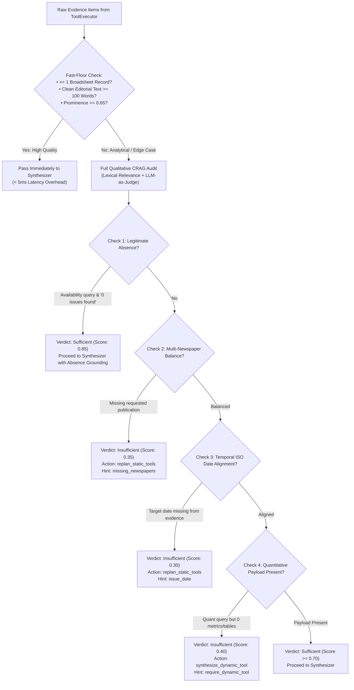
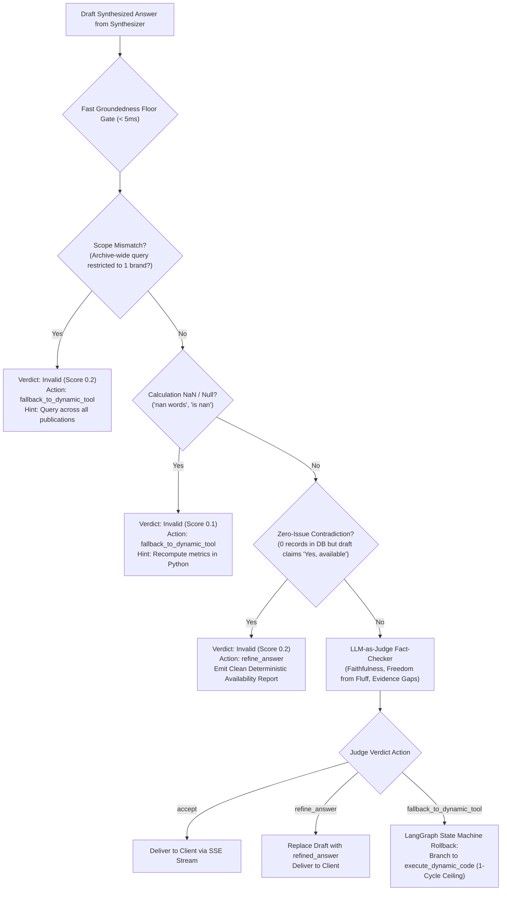
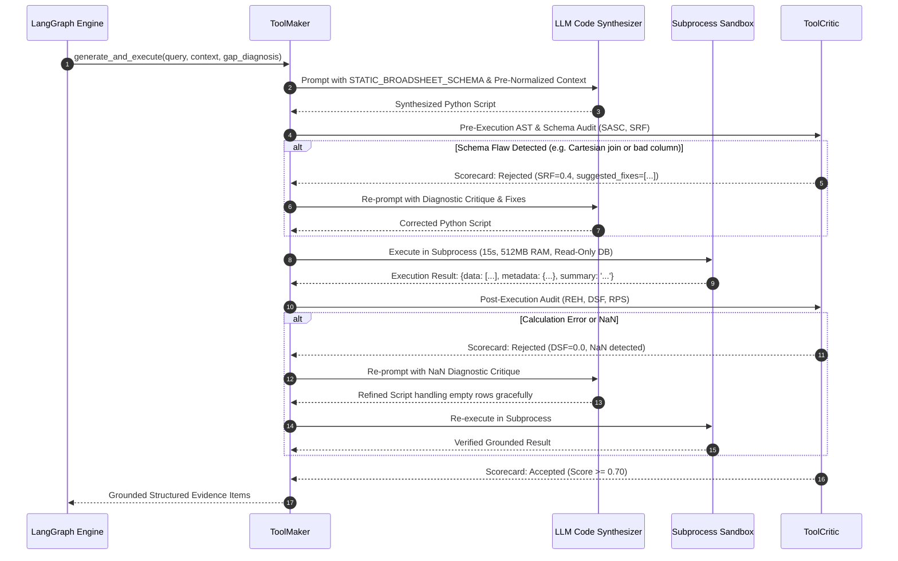

# NewsLens-AI: Hallucination Prevention, Corrective RAG (CRAG) & Self-Correcting Fallback Architecture

This document provides an exhaustive, production-grade architectural guide to **Hallucination Prevention, Corrective RAG (CRAG), Tool Critic Evaluation, and Closed-Loop Fallback Recovery** in **NewsLens-AI**. It details how the platform eliminates factual errors, prevents mathematical and relational schema hallucinations, audits evidence sufficiency, and dynamically self-corrects to deliver grounded broadsheet intelligence.

---

## 1. The Broadsheet Intelligence Threat Model

Retrieval-Augmented Generation (RAG) over historical print newspapers presents unique hallucination risks that conventional conversational RAG systems fail to handle:

```
┌────────────────────────────────────────────────────────────────────────────────────────┐
│                          BROADSHEET HALLUCINATION THREAT MATRIX                        │
├──────────────────────────┬────────────────────────────┬────────────────────────────────┤
│ Hallucination Category   │ Manifestation Failure      │ Real-World Broadsheet Example  │
├──────────────────────────┼────────────────────────────┼────────────────────────────────┤
│ **Relational Schema**    │ Model invents non-existent │ Querying `articles.published_at`│
│                          │ columns or joins           │ instead of `issues.issue_date`. │
├──────────────────────────┼────────────────────────────┼────────────────────────────────┤
│ **Cartesian Explosion**  │ Unconstrained 1:N joins    │ Joining articles & photos with │
│                          │ multiply count metrics     │ `COUNT(a.id)`, inflating count │
│                          │ by 5x to 20x               │ from 12 to 180 articles.       │
├──────────────────────────┼────────────────────────────┼────────────────────────────────┤
│ **Absence Contradiction**│ Model asserts positive     │ DB returns 0 issues on Sunday; │
│                          │ availability when the      │ LLM says: *"Yes, at least one  │
│                          │ archive contains 0 records │ issue is available on that date"│
├──────────────────────────┼────────────────────────────┼────────────────────────────────┤
│ **Publication Narrowing**│ Archive-wide query is      │ User asks: *"List all papers in│
│                          │ artificially restricted to │ July"*; LLM narrows to solely  │
│                          │ a single favorite brand    │ *"The Goan"* or *"The Hindu"*. │
├──────────────────────────┼────────────────────────────┼────────────────────────────────┤
│ **Mathematical / NaN**   │ Model computes `NaN` on    │ Dividing by 0 on empty sets    │
│                          │ empty sets or invents      │ yields `NaN words`; model prints│
│                          │ plausible averages         │ *"Average word count is NaN"*. │
├──────────────────────────┼────────────────────────────┼────────────────────────────────┤
│ **Context Contamination**│ Multi-turn session carries │ User attached a photo from Aug │
│                          │ forward stale asset date   │ 5, then asks about Aug 1; model│
│                          │ or headline across dates   │ retrieves the wrong story.     │
├──────────────────────────┼────────────────────────────┼────────────────────────────────┤
│ **Speculative Fluff**    │ Empty archive triggers     │ *"Investigate implications on  │
│                          │ management consulting      │ overall content strategy and   │
│                          │ boilerplate filler         │ editorial publication plans."* │
└──────────────────────────┴────────────────────────────┴────────────────────────────────┘
```

---

## 2. The 6-Layer Hallucination Defense Architecture

NewsLens-AI implements an end-to-end defense-in-depth framework across six distinct architectural layers:

```mermaid
flowchart TD
    UserQuery["User Query + Multi-Turn Context"] --> L1

    subgraph L1 ["Layer 1: Grounded Planning & Static Schema Decoupling"]
        P1["STATIC_BROADSHEET_SCHEMA Catalog"]
        P2["KNOWN_COLUMN_HALLUCINATIONS Mapping"]
        P3["Strict 7-Enum Contract for sql_analytics"]
        P4["Typo-Tolerant Brand Patterns & Date Regexes"]
        P5["Dynamic Analysis Permission Gate"]
    end

    L1 --> L2

    subgraph L2 ["Layer 2: AST Security & Sandboxed Subprocess Isolation"]
        S1["ASTSafetyScanner (Blocks os, sys, subprocess, eval)"]
        S2["Subprocess Sandbox (15s Timeout, 512MB RAM Cap)"]
        S3["Read-Only DB Connection with Auto-Rollback"]
        S4["Pre-Injected Math & Data Science Globals"]
    end

    L2 --> L3

    subgraph L3 ["Layer 3: Tool Critic 5-Metric Diagnostic Scorecard"]
        C1["SASC: Syntactic & AST Security Compliance"]
        C2["SRF: Schema Fidelity & Cartesian COUNT Prevention"]
        C3["REH: Runtime Execution & Subprocess Health"]
        C4["DSF: Data-to-Summary Faithfulness & Absence Logic"]
        C5["RPS: Intent Alignment & Filter Plausibility"]
        C6["Closed-Loop Refinement (Up to 3 Retries with Hints)"]
    end

    L3 --> L4

    subgraph L4 ["Layer 4: Corrective RAG (CRAG) Evidence Evaluation"]
        E1["Fast-Floor Bypass (<5ms for >= 100 Words Factual Body)"]
        E2["Lexical & Semantic Relevance Scoring (Stemming & Stopwords)"]
        E3["Reflexive LLM-as-Judge EvaluationVerdict"]
        E4["Comparative Multi-Newspaper Balance Audit"]
        E5["Temporal ISO Date Alignment Check"]
        E6["Quantitative Payload & Non-Zero Metric Verification"]
    end

    L4 --> L5

    subgraph L5 ["Layer 5: Blueprint-Driven Grounded Synthesis"]
        B1["Dynamic AnswerBlueprint (Strict Section Directives)"]
        B2["Mandatory Broadsheet Citation Contract"]
        B3["Quantitative Metric Absence Hard-Stop Directive"]
        B4["Deterministic Catalog Table Stripper for Narrative Reading"]
        B5["Photo Annotation Noise Suppressor"]
    end

    L5 --> L6

    subgraph L6 ["Layer 6: Reflective LLM Answer Verifier"]
        V1["Fast Groundedness Floor Gate (<5ms Deterministic Checks)"]
        V2["Publication Scope Contradiction Interceptor"]
        V3["Calculation NaN / Null Detector"]
        V4["Zero-Issue Contradiction Refiner (Emits Clean Facts)"]
        V5["Reflexive LLM Fact-Checking Critic (4 Dimensions)"]
        V6["Dynamic Tool Rollback (1-Cycle LangGraph Ceiling)"]
    end

    L6 --> VerifiedSSE["Verified, Factual SSE Stream Delivered to Client"]
```



---

## 3. Deep Dive into Defense Layers

### 3.1. Layer 1: Grounded Planning & Static Schema Decoupling
Located in [`archive_context.py`](file:///Users/piyushgoel/Downloads/Projects/NewsLens-AI/backend/app/agent/archive_context.py), [`extractor.py`](file:///Users/piyushgoel/Downloads/Projects/NewsLens-AI/backend/app/agent/extractor.py), and [`planner.py`](file:///Users/piyushgoel/Downloads/Projects/NewsLens-AI/backend/app/agent/planner.py):

1. **Declarative Static Broadsheet Schema**:
   The planner prompt does not receive an arbitrary relational schema or make runtime DB calls to inspect tables. It is provided a ~150-token static declarative catalog (`STATIC_BROADSHEET_SCHEMA`) describing the 6 core tables: `newspapers`, `issues`, `pages`, `articles`, `photos`, and `article_categories`.
2. **Column Hallucination Mapping (`KNOWN_COLUMN_HALLUCINATIONS`)**:
   Prevents common LLM hallucinations before code or queries are executed:
   - Hallucinated `published_at` $\to$ Automatically corrected to `issues.issue_date`.
   - Hallucinated `newspaper` $\to$ Automatically corrected to `newspapers.name`.
   - Hallucinated `category` $\to$ Mapped to `article_categories.name` via explicit table join.
   - Hallucinated `title` $\to$ Corrected to `articles.headline`.
   - Hallucinated `author` $\to$ Corrected to `articles.byline_author`.
3. **Strict 7-Enum Contract for `sql_analytics`**:
   The planner is bound by strict negative contracts: `sql_analytics` **only** supports 7 pre-compiled routines (`count_issues`, `count_articles`, `count_advertisements`, `count_photos`, `issue_summary`, `coverage_difference`, `shared_coverage`). It cannot execute custom SQL or compute averages.
4. **Dynamic Analysis Permission Boundary (`is_dynamic_analysis_permitted`)**:
   Ensures `dynamic_analysis` is only invoked for mathematical calculations, averages, distributions, and custom groupings. Pure reading or summarization requests (e.g. *"Summarize the lead article in 100 words"*) are barred from dynamic code synthesis, preventing code execution errors for narrative queries.

---

### 3.2. Layer 2: AST Security & Sandboxed Subprocess Isolation
Located in [`sandbox.py`](file:///Users/piyushgoel/Downloads/Projects/NewsLens-AI/backend/app/agent/sandbox.py) and [`tool_maker.py`](file:///Users/piyushgoel/Downloads/Projects/NewsLens-AI/backend/app/agent/tool_maker.py):

1. **AST Safety Scanner (`ASTSafetyScanner`)**:
   Before any synthesized Python code is written to disk or executed, it is parsed into an Abstract Syntax Tree (AST). The scanner traverses the tree and rejects any script that:
   - Imports unauthorized modules (`os`, `sys`, `subprocess`, `shutil`, `socket`, `http`, `urllib`, `requests`, `importlib`).
   - Invokes built-in dangerous functions (`eval`, `exec`, `open`, `compile`, `__import__`, `globals`, `locals`).
   - Accesses dunder attributes (`__class__`, `__subclasses__`, `__bases__`).
2. **Subprocess Isolation**:
   The validated script runs inside an isolated worker subprocess with:
   - Strict 15-second execution timeout.
   - 512 MB memory ceiling (via `resource.setrlimit`).
   - Read-only MySQL credentials (`mysql_readonly_url`) preventing any `INSERT`, `UPDATE`, `DELETE`, or `DROP` mutation.
   - Auto-injected standard math and data science libraries (`re`, `math`, `statistics`, `json`, `pandas`, `numpy`, `sqlalchemy.text`).

---

### 3.3. Layer 3: Tool Critic 5-Metric Diagnostic Scorecard
Located in [`tool_critic.py`](file:///Users/piyushgoel/Downloads/Projects/NewsLens-AI/backend/app/agent/tool_critic.py):

Generated dynamic tools are evaluated across 5 quantitative dimensions before their results can enter the agent's evidence stream:

| Metric | Dimension | Inspection Logic | Score Penalty |
|---|---|---|---|
| **SASC** | Syntactic & AST Compliance | Verifies syntax validity and absence of banned imports/builtins. | Rejection on violation (0.0). |
| **SRF** | SQL Relational Fidelity | Checks AST SQL query strings for non-existent columns, unparameterized string formatting, and unconstrained Cartesian joins (`COUNT(a.id)` across 1:N joins without `DISTINCT`). | -0.3 per bad column, -0.2 per Cartesian risk. |
| **REH** | Runtime Health | Evaluates exit code, execution duration, and standard error traces. | 0.0 on crash or timeout. |
| **DSF** | Data-to-Summary Faithfulness | Audits internal consistency between raw execution data/metadata and generated summary. | 0.1 on positive count claim over 0 rows. 0.0 on unhandled `NaN`. |
| **RPS** | Intent & Filter Plausibility | Ensures date arguments match ISO formats and newspaper names match archive context. | -0.3 on format defects. |

#### The "Legitimate Absence" Discrimination Invariant
A major breakthrough in NewsLens-AI is the discrimination between **legitimate archival absence** and **hallucination**:
- If a database query returns 0 rows, and the generated summary truthfully states *"No articles or issues were found in the archive for 2026-04-28"*, the DSF score is **1.0 (Accepted)**.
- If the database query returns 0 rows, but the summary claims *"The archive contains 12 articles discussing economic policy"*, the DSF score is **0.1 (Severe Hallucination Rejection)**.

---

### 3.4. Layer 4: Corrective RAG (CRAG) & Evidence Evaluation Gate
Located in [`evaluator.py`](file:///Users/piyushgoel/Downloads/Projects/NewsLens-AI/backend/app/agent/evaluator.py):

After the `ToolExecutor` executes planned tools, the retrieved items enter the CRAG `EvidenceEvaluator`:



#### The CRAG `EvaluationVerdict`
The evaluator emits a typed `EvaluationVerdict` data structure stored in `AgentState`:
- `is_sufficient: bool`
- `quality_score: float` (0.0 to 1.0)
- `gap_reason: str | None`
- `detected_gaps: list[str]` (e.g. `["missing_newspaper_coverage:Mint"]`, `["zero_count_aggregate_gap"]`)
- `recommended_action: str` (`"proceed_to_synthesis"`, `"replan_static_tools"`, `"synthesize_dynamic_tool"`)
- `corrective_hints: dict[str, Any]`

---

### 3.5. Layer 5: Blueprint-Driven Grounded Synthesis
Located in [`synthesizer.py`](file:///Users/piyushgoel/Downloads/Projects/NewsLens-AI/backend/app/agent/synthesizer.py) and [`models.py`](file:///Users/piyushgoel/Downloads/Projects/NewsLens-AI/backend/app/agent/models.py):

Rather than asking the LLM to write a generic response, the synthesizer compiles the planner's declarative `AnswerBlueprint` into structured section directives:

1. **Section Specifications (`SectionSpec`)**:
   Directs the model to generate explicit sections (e.g., `### ⚡ Executive Overview`, `### 📊 Comparative Analysis Matrix`, `### 🔍 Editorial Divergence`) with enforced presentation types (`narrative`, `bullet_list`, `markdown_table`, `metric_card`).
2. **Quantitative Metric Absence Hard-Stop**:
   The prompt injects an immutable directive:
   > *"If statistical, volume, or average metrics were requested but the tool results returned 0 records or could not be computed, you MUST explicitly state that the metrics are unavailable. You are STRICTLY FORBIDDEN from estimating, guessing, or making up numbers."*
3. **Robotic Catalog Table Stripper**:
   When answering focused single-article questions (e.g., *"Summarize the article on renewable energy"*), the synthesizer deterministically strips mechanical catalog tables (`| # | Headline | Section | Page | Words |`), preserving journalistic narrative focus.
4. **Mandatory Broadsheet Citation Contract**:
   Every factual claim must cite its source broadsheet: `[Newspaper, YYYY-MM-DD, Page N, "Headline"]`. The synthesizer correlates these with visual asset IDs to generate interactive frontend citation cards with thumbnail previews (`/api/photos/{id}/image`).

---

### 3.6. Layer 6: Reflective LLM Answer Verifier & Fact-Checking Critic
Located in [`answer_verifier.py`](file:///Users/piyushgoel/Downloads/Projects/NewsLens-AI/backend/app/agent/answer_verifier.py):

The synthesized response is not sent directly to the client. It is audited by the `AnswerVerifier` across four dimensions:



---

## 4. Closed-Loop Fallback Recovery & Self-Correction Mechanisms

When an evidence gap, retrieval failure, or ungrounded synthesis is detected, NewsLens-AI does not fail or present a blank screen. It activates four closed-loop fallback pathways designed to improve the response iteratively:

```
┌────────────────────────────────────────────────────────────────────────────────────────┐
│                          4-TIER CLOSED-LOOP FALLBACK PATHWAYS                          │
├────────────────────┬─────────────────────────────┬─────────────────────────────────────┤
│ Fallback Pathway   │ Triggering Condition        │ Iterative Self-Correction Applied   │
├────────────────────┼─────────────────────────────┼─────────────────────────────────────┤
│ **Pathway 1:**     │ CRAG detects missing        │ • Relaxes narrow page & section filters│
│ **Adaptive Static**│ newspaper or over-          │ • Broadens date ranges              │
│ **Re-Planning**    │ constrained date bounds     │ • Dynamically scales top_k = max(8, k+4)│
│                    │                             │ • Anti-repetition guard prevents dups│
├────────────────────┼─────────────────────────────┼─────────────────────────────────────┤
│ **Pathway 2:**     │ Query requires calculations │ • Injects validated context & schema │
│ **Dynamic Tool**   │ or static tools return 0    │ • Synthesizes bespoke Python/SQL code│
│ **Synthesis**      │ counts                      │ • ToolCritic audits 5 metrics (3x)   │
├────────────────────┼─────────────────────────────┼─────────────────────────────────────┤
│ **Pathway 3:**     │ Answer Verifier catches     │ • Emits clean grounded answer without│
│ **In-Flight Answer**│ availability contradiction  │   consulting fluff                   │
│ **Refinement**     │ or speculative filler       │ • Injects accurate archive bounds    │
├────────────────────┼─────────────────────────────┼─────────────────────────────────────┤
│ **Pathway 4:**     │ Inquiries outside broadsheet│ • 4-tier live news search cascade   │
│ **External Web &** │ coverage dates or unindexed │ • NewsData.io ➔ Serper ➔ Tavily ➔ DDG│
│ **Truthful Silence**│ archival absence            │ • Or authoritative Anti-Hallucination│
│                    │                             │   Notice confirming archival silence │
└────────────────────┴─────────────────────────────┴─────────────────────────────────────┘
```

---

### 4.1. Pathway 1: Adaptive Static Re-Planning (`replan_with_feedback_async`)
Located in [`planner.py`](file:///Users/piyushgoel/Downloads/Projects/NewsLens-AI/backend/app/agent/planner.py):

When the CRAG Evaluator identifies an evidence deficiency, it invokes `replan_with_feedback_async(query, gap_diagnosis, attempted_tools)`.

#### Specific Improvements Applied:
1. **Filter Relaxation**: If the initial plan failed because a `page_filter` (e.g. `page="1"`) or `category_filter` was too restrictive, the re-planner automatically strips the page and category constraints.
2. **Dynamic Top-K Scaling**: Scaled via `top_k = max(8, int(current_top_k) + 4)`. If the initial attempt retrieved 6 chunks, the re-planned pass retrieves 10 chunks, expanding the candidate retrieval window.
3. **Anti-Repetition Guard**: Checks the proposed tool call against `attempted_tools`. If the model attempts to emit the exact same tool and arguments that already failed, the re-planner mutates the arguments or substitutes an alternative retrieval strategy.
4. **Strict Single-Cycle Ceiling**: Re-planning is strictly capped at **1 recovery cycle** (`recovery_attempts < 1`), ensuring predictable response latency.

---

### 4.2. Pathway 2: Dynamic Tool Synthesis (ToolMaker & ToolCritic Loop)
Located in [`tool_maker.py`](file:///Users/piyushgoel/Downloads/Projects/NewsLens-AI/backend/app/agent/tool_maker.py) and [`tool_critic.py`](file:///Users/piyushgoel/Downloads/Projects/NewsLens-AI/backend/app/agent/tool_critic.py):

When an analytical question cannot be answered by static search, or when static counts return 0, the system triggers the **LLM-as-Tool-Maker** engine:



---

### 4.3. Pathway 3: In-Flight Answer Refinement
Located in [`answer_verifier.py`](file:///Users/piyushgoel/Downloads/Projects/NewsLens-AI/backend/app/agent/answer_verifier.py):

If the synthesis contains contradictions or speculative consulting fluff, the `AnswerVerifier` intervenes **before transmission**:
- It extracts verified facts from the evidence metadata (such as the verified archival date range and active publications).
- It synthesizes an authoritative `refined_answer` adhering strictly to verified broadsheet reality.
- The raw drafted hallucination is discarded in memory, and the clean `refined_answer` is streamed to the user via SSE.

---

### 4.4. Pathway 4: External Web Grounding & Truthful Silence
Located in [`web_search.py`](file:///Users/piyushgoel/Downloads/Projects/NewsLens-AI/backend/app/retrieval/web_search.py) and [`synthesizer.py`](file:///Users/piyushgoel/Downloads/Projects/NewsLens-AI/backend/app/agent/synthesizer.py):

When a user query refers to events completely outside the archive (e.g. inquiring about 2024 when the archive covers 2026), the system executes a dual response:
1. **Accredited Web Search**: Queries NewsData.io and Google Search (Serper) to obtain external grounding, tagging all results explicitly as `[Live Web Context]`.
2. **Authoritative Anti-Hallucination Notice**: If both the broadsheet archive and external search find no verified records, the system displays an authoritative notice:
   > *"No archival records or verified news reporting could be found for this inquiry within the broadsheet archive. The archive covers [Start Date] to [End Date] across [List of Newspapers]."*

---

## 5. Verification Matrix & Quality Guarantees

| Metric / Requirement | Target Standard | Enforcement Engine | Failure Recovery Action |
|---|---|---|---|
| **SQL Column Accuracy** | 100% Valid Columns | `STATIC_BROADSHEET_SCHEMA` + `KNOWN_COLUMN_HALLUCINATIONS` | Pre-execution AST check replaces invalid column names before SQL execution. |
| **Relational Join Multipliers** | Zero Cartesian Inflation | `ToolCritic.audit_sql_schema()` | Detects 1:N joins without `DISTINCT`; re-prompts LLM to insert `COUNT(DISTINCT a.id)`. |
| **Legitimate Absence Fidelity** | 100% Grounded Absences | `ToolCritic.audit_data_to_summary()` & `AnswerVerifier` | Treats zero rows as verified absence; penalizes positive claims with 0.1 score. |
| **Mathematical Soundness** | Zero `NaN` or unhandled errors | `ToolCritic` & `AnswerVerifier` | Flags `NaN` in summaries; triggers code re-synthesis with empty dataset handling. |
| **Broadsheet Citations** | Minimum 1 Citation per Claim | `AnswerSynthesizer` | Enforces format `[Newspaper, YYYY-MM-DD, Page N, "Headline"]` with thumbnail cards. |
| **Execution Latency Cap** | Fast Path < 5ms, Re-plan < 1 Cycle | `EvidenceEvaluator` fast-floor & LangGraph state machine | Fast-floor bypass skips LLM evaluators on clear high-confidence hits. |
