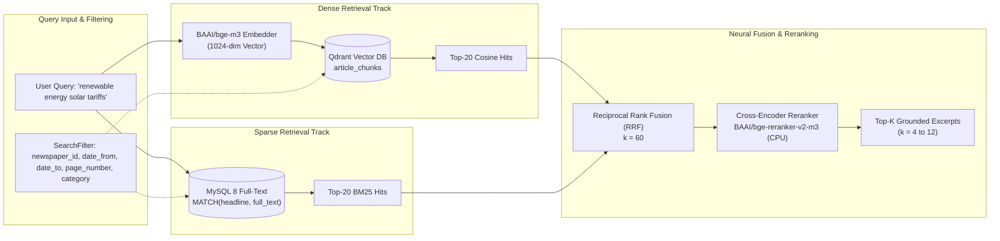
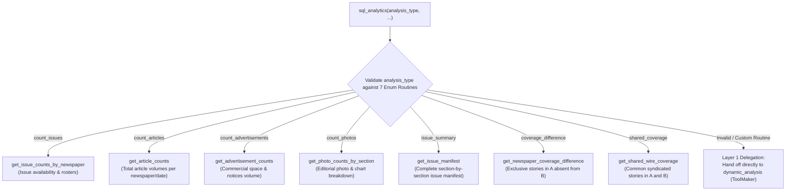
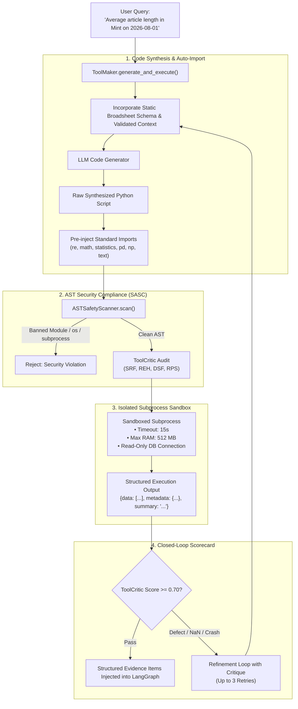
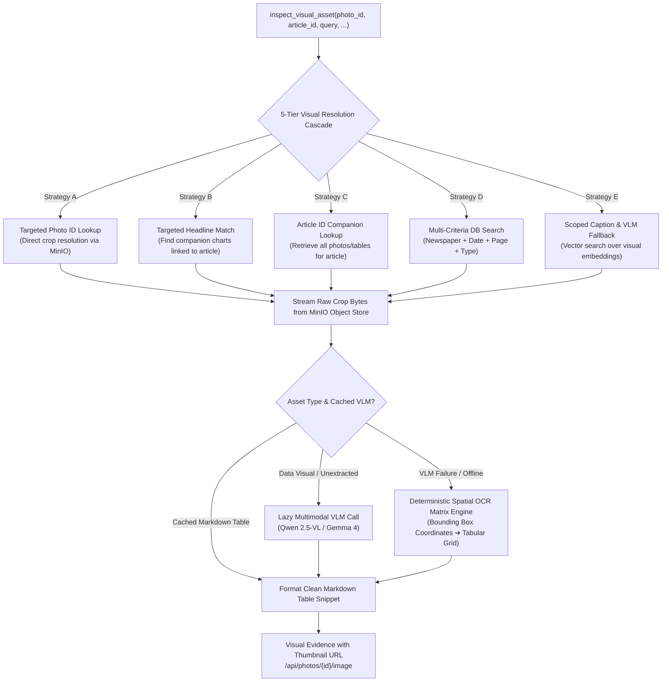
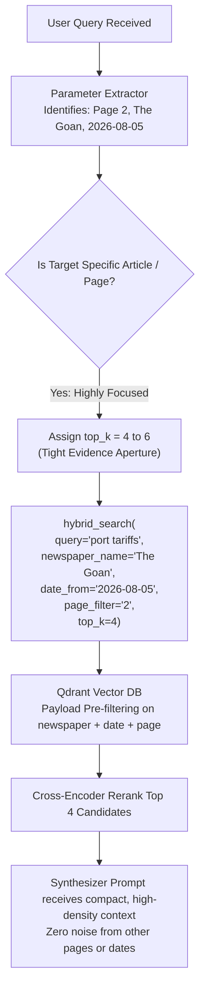
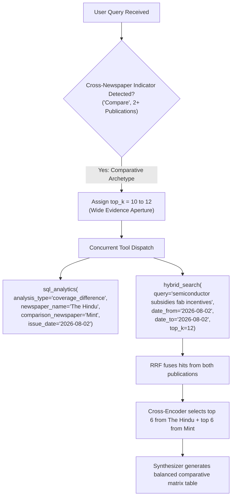
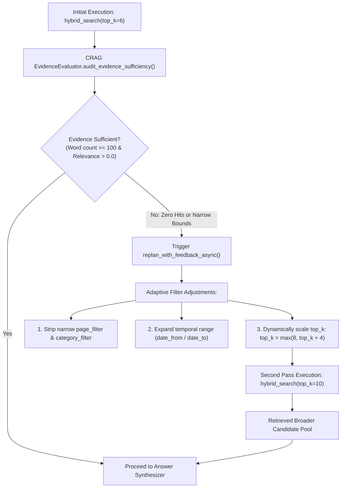

# NewsLens-AI: Comprehensive Tools Reference Guide & Dynamic Top-K Architecture

This document serves as the authoritative technical reference for all **8 core retrieval, analytical, and multimodal tools** in NewsLens-AI. It details their functional capabilities, execution engines, schemas, validation contracts, error-recovery mechanisms, and a deep-dive analysis into dynamic `top_k` scaling across heterogeneous query archetypes.

---

## 1. Executive Summary & Tool Registry Taxonomy

NewsLens-AI employs a decoupled, agentic tool orchestration layer located in [`backend/app/agent/`](file:///Users/piyushgoel/Downloads/Projects/NewsLens-AI/backend/app/agent/). Rather than relying on rigid, hardcoded heuristics or unbounded recursive LLM tool-calling loops, the platform uses a **high-cohesion single-turn direct planner** that emits an ordered sequence of 1 to 3 planned tool calls ([`PlannedToolCall`](file:///Users/piyushgoel/Downloads/Projects/NewsLens-AI/backend/app/agent/models.py)) executed concurrently by the [`ToolExecutor`](file:///Users/piyushgoel/Downloads/Projects/NewsLens-AI/backend/app/agent/executor.py).

### Global Tool Matrix

| # | Tool Identifier | Execution Engine / Class | Target Data Store | Primary Journalistic Intent | Deterministic / Generative |
|---|---|---|---|---|---|
| 1 | `hybrid_search` | `HybridSearchEngine` | Qdrant (Dense 1024d) + MySQL (Sparse BM25) | Semantic facts, quotes, lead stories, and section articles | Deterministic Multi-Index Retrieval + Neural RRF |
| 2 | `sql_analytics` | `SQLAnalyticsDispatcher` & `SQLAnalyticsEngine` | MySQL 8 (Relational System of Record) | 7 pre-compiled relational manifests, issue/article counts, coverage diffs | Deterministic Pre-Compiled SQL |
| 3 | `dynamic_analysis` | `ToolMaker`, `ASTSafetyScanner`, `SandboxedExecutor` | MySQL 8 (Read-Only) via Subprocess Sandbox | Statistical aggregations, ratios, distributions, averages, medians | Generative Code Synthesis + AST Gate |
| 4 | `inspect_visual_asset` | `VisualInspectionEngine` | MinIO Object Store + VLM (Cloud/Ollama) + RapidOCR | Multi-chart data transcription, scene analysis, infographic reading | Multimodal VLM + Deterministic OCR Matrix |
| 5 | `entity_search` | `EntitySearchEngine` | MySQL 8 (`entities`, `article_entities`, `relations`) | Multi-hop corporate/political profiles and co-occurrence graphs | Deterministic Relational Graph Query |
| 6 | `timeline_builder` | `TimelineBuilder` | Qdrant + MySQL (`articles`, `issues`) | Chronological narrative trajectories and milestone storylines | Hybrid Retrieval + Temporal Clustering |
| 7 | `coverage_analysis` | `CoverageAnalyzer` | MySQL 8 + `HybridSearchEngine` | Multi-newspaper omission audit and negative coverage matrix | Comparative Relational Matrix + Semantic Cross-Check |
| 8 | `web_search` | `WebSearchEngine` | NewsData.io ➔ Serper ➔ Tavily ➔ DuckDuckGo | Live external news grounding beyond archive date bounds | External Live API Cascade |

---

## 2. Deep Dive: The 8 Canonical Tools

### 2.1. `hybrid_search`

#### Purpose & Capabilities
`hybrid_search` is the primary workhorse for textual information retrieval across broadsheet newsprint archives. It combines dense semantic embeddings with sparse lexical full-text search, eliminating vocabulary mismatch while preserving precise keyword recall (e.g. statutory acts, bill numbers, names).



#### Argument Schema
| Parameter | Type | Required | Default | Description |
|---|---|---|---|---|
| `query` | `string` | Yes | - | Substantive topical query string stripped of conversational filler. |
| `newspaper_name` | `string` | No | `None` | Canonical publication name (e.g., `"The Hindu"`, `"The Goan"`). |
| `date_from` | `string` | No | `None` | ISO start date (`YYYY-MM-DD`). |
| `date_to` | `string` | No | `None` | ISO end date (`YYYY-MM-DD`). |
| `page_filter` | `string` / `int` | No | `None` | Broadsheet page constraint (e.g., `"1"` for front page). |
| `category_filter` | `string` | No | `None` | Editorial category (e.g., `"Business"`, `"Health"`, `"Politics"`). |
| `top_k` | `integer` | No | `6` | Maximum number of reranked evidence passages to return (4 to 12). |

#### Evidence Item Output
```json
{
  "article_id": 42105,
  "issue_id": 812,
  "headline": "Cabinet Approves Revised Solar Rooftop Subsidy Norms",
  "byline_author": "Special Correspondent",
  "newspaper_name": "The Hindu",
  "issue_date": "2026-08-04",
  "pages": [1, 4],
  "bboxes": [{"x": 120, "y": 340, "w": 450, "h": 620}],
  "snippet": "NEW DELHI: The Union Cabinet on Monday cleared the revised solar rooftop subsidy framework...",
  "prominence_score": 0.89,
  "source_tool": "hybrid_search",
  "section": "National",
  "word_count": 482,
  "has_visual_data": false,
  "parent_article_text": "NEW DELHI: The Union Cabinet on Monday cleared..."
}
```

#### Adaptive Fallback
If `hybrid_search` returns 0 hits when a `category_filter` is applied, `ToolExecutor._execute_hybrid_search` automatically executes an **adaptive relaxation fallback**, re-querying without the category filter while retaining publication, date, and page constraints.

---

### 2.2. `sql_analytics`

#### Purpose & Capabilities
`sql_analytics` executes structured relational queries against the MySQL system of record. To prevent database exhaustion, SQL injection, or hallucinated schema joins, it is strictly bound to an immutable enum of **7 pre-compiled broadsheet analytical routines**.



#### Strict Negative Boundary
> [!IMPORTANT]
> `sql_analytics` **CANNOT** execute ad-hoc SQL, **CANNOT** calculate averages, and **CANNOT** compute word counts, medians, ratios, or correlations. Scheduling `sql_analytics` for any computation outside these 7 enums triggers immediate delegation to `dynamic_analysis`.

#### Argument Schema
| Parameter | Type | Required | Description |
|---|---|---|---|
| `analysis_type` | `string` | Yes | One of: `"count_issues"`, `"count_articles"`, `"count_advertisements"`, `"count_photos"`, `"issue_summary"`, `"coverage_difference"`, `"shared_coverage"`. |
| `newspaper_name` | `string` | Conditional | Source newspaper name (required for single-paper summaries/counts). |
| `comparison_newspaper`| `string` | Conditional | Target newspaper name (required for `coverage_difference` and `shared_coverage`). |
| `issue_date` | `string` | Conditional | Target publication date (`YYYY-MM-DD`). |
| `date_from` / `date_to` | `string` | Conditional | Date range for temporal count queries. |
| `category_filter` | `string` | No | Section or topic filter (e.g. `"Economy"`). |
| `page_filter` | `string` | No | Target page number. |
| `query` | `string` | Conditional | Topical keyword for differential or shared coverage matching. |

---

### 2.3. `dynamic_analysis` (LLM-as-Tool-Maker)

#### Purpose & Capabilities
`dynamic_analysis` is an autonomous on-demand code synthesis and execution engine. When a query demands mathematical computations, custom groupings, averages, ratios, correlations, or schema joins that exceed the 7 fixed routines of `sql_analytics`, the system synthesizes bespoke Python and SQL code, validates it through an Abstract Syntax Tree (AST) security scanner, and executes it inside an isolated subprocess sandbox.



#### Guardrail Boundary (`is_dynamic_analysis_permitted`)
Dynamic analysis is strictly prohibited from running on narrative reading or text summarization tasks where word count represents an output constraint rather than a database aggregation (e.g., *"Summarize this article in 100 words"*). In such cases, the planner routes exclusively to `hybrid_search`.

---

### 2.4. `inspect_visual_asset`

#### Purpose & Capabilities
`inspect_visual_asset` provides multimodal inspection of editorial photographs, infographics, financial charts, and tables printed on newspaper pages. It utilizes a **5-Tier Strategy Cascade (A through E)** to retrieve, crop, and transcribe visual assets.



#### Multi-Chart Handling
When an article contains multiple companion data charts (for example, four companion charts in a G20/BRICS economic analysis), `inspect_visual_asset` iterates across all companion visual assets, transcribing each chart's tabular data into clean Markdown without truncation.

---

### 2.5. `entity_search`

#### Purpose & Capabilities
`entity_search` performs relational entity lookups across the `entities`, `article_entities`, and `entity_relations` tables. It tracks individuals, organizations, locations, products, and statutory bodies across the broadsheet archive.

#### Key Functions
- **Entity Profiling**: Retrieves salience scores, mention frequencies, and sentiment across newspapers.
- **Co-Occurrence Network**: Identifies associated entities and corporate affiliations.
- **Cross-Newspaper Scrutiny**: Compares how different editorial desks portray the same public figure or entity.

#### Argument Schema
| Parameter | Type | Required | Description |
|---|---|---|---|
| `entity_name` | `string` | Yes | Name of individual, company, or institution (e.g. `"Adani Group"`, `"RBI"`). |
| `top_k` | `integer` | No (default: 10) | Number of salient article associations to retrieve. |
| `newspaper_name` | `string` | No | Scope search to a specific publication. |
| `date_from` / `date_to` | `string` | No | Restrict entity mentions to a date range. |

---

### 2.6. `timeline_builder`

#### Purpose & Capabilities
`timeline_builder` tracks narrative trajectories and evolving storylines across multiple days, weeks, or months. Rather than returning disconnected search snippets, it groups retrieved milestone articles into chronological date buckets.

```
┌────────────────────────────────────────────────────────────────────────┐
│               TIMELINE CLUSTER FOR: "High-Speed Rail Project"          │
├───────────────────┬────────────────────────────────────────────────────┤
│ 2026-06-15        │ State clears land acquisition framework (Page 1)  │
│ 2026-07-02        │ Environmental tribunal raises coastal objections   │
│ 2026-07-28        │ Revised tunneling blueprint submitted to Cabinet   │
│ 2026-08-10        │ Final contract inked with international consortium │
└───────────────────┴────────────────────────────────────────────────────┘
```

#### Argument Schema
| Parameter | Type | Required | Description |
|---|---|---|---|
| `query` | `string` | Yes | Developing topic or story headline. |
| `limit` | `integer` | No (default: 25) | Maximum number of chronologically grouped articles to retrieve. |

---

### 2.7. `coverage_analysis`

#### Purpose & Capabilities
`coverage_analysis` conducts negative coverage audits, answering queries such as: *"Did The Indian Express report on the port strike on 2026-08-03?"* or *"What major national stories were absent from The Goan?"*.

#### The 3-Tier Coverage Matrix
1. **Primary Coverage**: Verifies direct coverage within the target publication.
2. **Corroborating Coverage**: Checks whether competing broadsheets covered the same event on that date.
3. **Omission Verdict**: Formulates an authoritative audit confirming whether the silence represents an editorial omission or an event that did not occur.

---

### 2.8. `web_search`

#### Purpose & Capabilities
`web_search` grounds queries in real-time internet reporting when an inquiry extends beyond the local archive's date boundaries or concerns live breaking news. It operates through an accredited 4-tier cascade:
1. **NewsData.io**: Primary journalistic API querying accredited global and national press agencies.
2. **Serper API**: Fallback Google Search engine snippets.
3. **Tavily API**: AI research engine optimized for RAG context extraction.
4. **DuckDuckGo**: Zero-cost, zero-credential HTML fallback scraper.

---

## 3. Dynamic Top-K Retrieval Architecture

In a production broadsheet intelligence platform, **hardcoding a static `top_k` (e.g. `k=5`) leads to two severe retrieval failure modes**:
1. **Context Dilution (False Positive Bleed)**: For targeted factoid lookups or single-article inquiries, retrieving 10+ chunks floods the prompt with irrelevant filler, causing the LLM to hallucinate or wander off-topic.
2. **Coverage Starvation (Comparative Blindness)**: For cross-newspaper comparisons or broad thematic overviews, retrieving only 3 to 5 chunks fails to represent competing editorial desks, creating one-sided summaries.

NewsLens-AI solves this through a **Dynamic Top-K Decision Framework** embedded directly into [`planner.py`](file:///Users/piyushgoel/Downloads/Projects/NewsLens-AI/backend/app/agent/planner.py) and [`tool_factory.py`](file:///Users/piyushgoel/Downloads/Projects/NewsLens-AI/backend/app/agent/tool_factory.py).

### 3.1. Top-K Allocation Across Query Archetypes

```
┌─────────────────────────────────────────────────────────────────────────────────────────┐
│                                DYNAMIC TOP-K RETRIEVAL MATRIX                           │
├──────────────────────────────┬───────────────┬──────────────────────────────────────────┤
│ Query Archetype              │ Top-K Range   │ Architectural Rationale                  │
├──────────────────────────────┼───────────────┼──────────────────────────────────────────┤
│ `factual_lookup`             │ top_k = 4 - 6 │ High precision; prevents context dilution│
│ `inspect_visual_asset`       │ top_k = 4     │ Secondary text context for chart focus   │
│ `article_catalog`            │ top_k = 6 - 8 │ Balanced manifest & lead highlights      │
│ `thematic_timeline`          │ top_k = 8     │ Anchor articles across date clusters     │
│ `entity_deep_dive`           │ top_k = 8 - 10│ Comprehensive entity mention coverage    │
│ `cross_newspaper_comparison` │ top_k = 10 - 12│ Diverse multi-broadsheet representation  │
│ `analytical_computation`     │ top_k = 4     │ Contextual text backing SQL/dynamic code │
│ `crag_adaptive_replan`       │ top_k + 4     │ Relaxation expansion on evidence gap     │
└──────────────────────────────┴───────────────┴──────────────────────────────────────────┘
```

---

### 3.2. Top-K Scaling Flowcharts Across Operational Scenarios

#### Scenario A: Targeted Factual Lookup & Visual Asset Inspection (`top_k = 4 to 6`)
*User Prompt: "What did the Chief Minister say about port tariffs on page 2 of The Goan on 2026-08-05?"*



---

#### Scenario B: Cross-Newspaper Comparison & Editorial Synthesis (`top_k = 10 to 12`)
*User Prompt: "Compare how The Hindu and Mint reported on the new semiconductor subsidies on 2026-08-02."*



---

#### Scenario C: CRAG Adaptive Re-Planning & Dynamic Aperture Expansion (`top_k = max(8, top_k + 4)`)
*When the initial search encounters an evidence shortfall or over-constrained filters.*



---

## 4. Parameter Reconciliation & Sanitization Contracts

All tool invocations pass through [`reconcile_and_sanitize_arguments()`](file:///Users/piyushgoel/Downloads/Projects/NewsLens-AI/backend/app/agent/tool_factory.py) before dispatch. This layer reconciles model arguments against ground-truth regexes and active session parameters:

1. **Generic Filler Cleansing**: Intercepts prompt few-shot filler phrases (e.g., *"newspaper coverage comparison"*, *"compare newspapers"*) and replaces them with substantive topical keywords or active category terms.
2. **Brand Normalization**: Maps colloquial abbreviations (`TOI`, `HT`, `ET`, `IE`, `BS`) to canonical titles (`"The Times of India"`, `"Hindustan Times"`, `"The Economic Times"`).
3. **Date Harmonization**: Normalizes dates into ISO `YYYY-MM-DD`. If a date range is requested, it ensures `date_from` and `date_to` take precedence over single-day `issue_date` parameters.
4. **Attached Asset Date Priority**: When an attached asset (e.g. photo or article) is active in the session, its metadata is merged unless the user query explicitly specifies a different target date, in which case the stale asset context is pruned.

---

## 5. Summary of Tool Invocations by Query Archetype

| Archetype | Primary Planned Tools | Typical Payload Configuration | Output Presentation |
|---|---|---|---|
| `factual_lookup` | `hybrid_search` (primary), `inspect_visual_asset` (if visual) | `top_k=6`, `newspaper_name`, `date_from`, `date_to`, `page_filter` | Direct narrative findings + operational bullet points + citations |
| `article_catalog` | `sql_analytics` (`issue_summary`) | `newspaper_name`, `issue_date`, `category_filter` | Structured Markdown manifest table + lead story highlights |
| `cross_newspaper_comparison` | `sql_analytics` (`coverage_difference` or `shared_coverage`) + `hybrid_search` | `newspaper_name`, `comparison_newspaper`, `issue_date`, `top_k=12` | Comparative coverage matrix table + editorial divergence narrative |
| `thematic_timeline` | `timeline_builder` + `hybrid_search` | `query`, `limit=25`, `top_k=8` | Chronological dated milestone timeline + narrative trajectory |
| `quantitative_trend` | `sql_analytics` (`count_issues`, `count_articles`, `count_photos`, `count_advertisements`) | `analysis_type`, `date_from`, `date_to`, `newspaper_name` | Direct authoritative findings + compact metric cards |
| `entity_deep_dive` | `entity_search` + `hybrid_search` | `entity_name`, `top_k=10` | Executive profile + corporate actions + media scrutiny narrative |
| `negative_coverage_audit` | `coverage_analysis` + `sql_analytics` | `query`, `target_date`, `newspaper_name` | 3-tier coverage matrix table (Primary, Corroborating, Omission verdict) |
| `analytical_computation` | `dynamic_analysis` (ToolMaker) | `query`, `analysis_description` | Computed mathematical metrics + verified tabular statistics |
